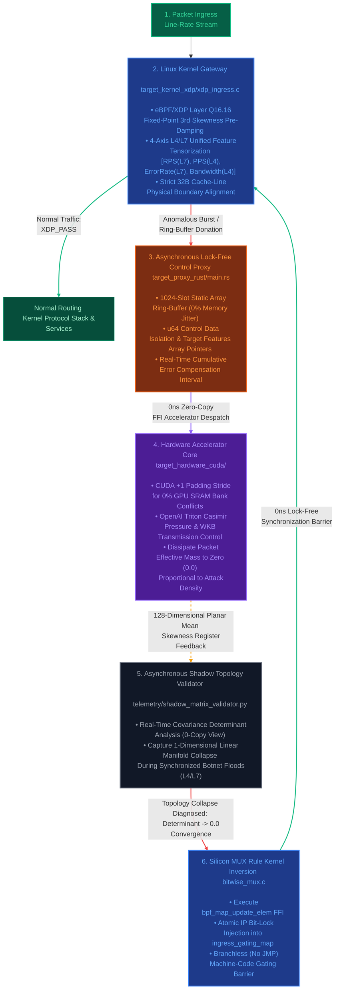

### Architectural Scope & Directional PoC

**Please note that this repository is a high-level Proof-of-Concept (PoC)** validating the integration of eBPF/XDP Kernel Data Planes, Asynchronous Rust Control Proxies, and CUDA/Triton Hardware-Accelerated Interlocks to neutralize volumetric DDoS bursts at the machine-code level without auto-scaling reliance. Community collaboration is welcomed.

---

### Motivation

When hit by a volumetric DDoS burst, why must the defender inherently suffer exponential infrastructure and financial liabilities?

"Let’s engineer a structural paradigm where an ongoing DDoS attack only bleeds the attacker’s financial and computing assets" (**Capital Asymmetry Resolution**) → "To achieve this, we must stop parsing packets individually and instead dissolve them as a collective mathematical wave" (**Mathematical Dissipation**) → "To achieve that, we must inspect the topological trajectory of the traffic manifold without copying or inspecting the payload" (**Non-Invasive Telemetry**) → Could this effectively dissipate the attacker's botnet assets with zero compute-overhead or cost on the defender's side? → Furthermore, let us design this with built-in extensibility to pinpoint the physical coordinates of malicious botnet clusters or freeze their attack assets network-wide.

---

### Strategy for Mathematical Dissipation

→ We stream the metrics harvested at the bare-metal network interface layer (**eBPF/XDP**) directly onto the hardware accelerator (**NVIDIA CUDA/Triton**) register lanes via an overhead-free zero-copy interlock, dissolving the volumetric burst through deterministic linear algebra.

### Architectural Layout & Interlock Mechanism

→ At the Linux kernel packet ingress gate (**XDP**), we structure the incoming metrics into localized tensors strictly aligned to 32-byte hardware cache-line boundaries. By hijacking the memory address lines via user-space lock-free ring buffers (`bpf_ringbuf`), we execute a **direct register donation** to the accelerator (NVIDIA GPU) execution rail. → Next, we induce native high-speed vectorized load primitives (`LDG.E.128`) to completely bypass GPU Shared Memory **Bank Conflicts** on the Streaming Multiprocessor (SM) on-chip SRAM. Utilizing **Fused Multiply-Add (FMA)** hardware instructions and **Special Function Unit (SFU)** clock primitives, we compute the 3rd asymmetric moment (skewness) and the covariance determinant. This forces the **numerical collapse trajectory** where Det → 0.0, neutralizing the malicious surge through a deterministic, **branchless execution pipeline**.

### Even with a zero-copy ring buffer, wouldn't routing packets from the NIC through the OS kernel and across the PCIe bus to the GPU for algebraic calculation—and then back to the kernel—introduce a physical host-to-device latency bottleneck far worse than the line-rate packet drop window?

→ We isolate the pipeline into a dual-path layout: individual packets are processed instantaneously at the kernel layer using nanosecond-scale bitwise operations, while network statistics are batched at millisecond intervals and asynchronously dispatched to the GPU. This eliminates the **PCIe bus bottleneck** while continuously returning macroscopic feedback loops. → Upon packet ingress, the network plane executes immediate gating or passing based on eBPF-driven branchless bit masks (**Zero-GPU Intervention**), while the telemetric indicators are streamed out in the background via lock-free ring buffers.

---

### For deep dives into code-level architecture and low-level internal implementations, please refer to the specifications below:

> *   [Comprehensive Infrastructure Zero-Copy Interlock & Mathematical Dissipation Architecture (`docs/ARCHITECTURE.md`)](./docs/ARCHITECTURE.md)
> *   [eBPF/XDP Kernel Data Plane & Branchless MUX Specification (`docs/KERNEL_DATA_PLANE.md`)](./docs/KERNEL_DATA_PLANE.md)
> *   [CUDA On-Chip Shared Memory Bank Conflict Eradication & SASS Optimization Specification (`docs/ACCELERATOR_CORE.md`)](./docs/ACCELERATOR_CORE.md)

---

This project physically decouples the real-time execution path (**Hot Path**) from the accelerator analysis path (**Shadow Path**) to **entirely bypass the physical communication latency bottleneck between the OS Kernel ↔ PCIe Bus ↔ GPU Accelerator**.

*   **Real-Time Execution (Hot Path):** `bitwise_mux.c` deploys integer bitwise masks without a single conditional branch, executing deterministic packet passing or instantaneous drop in a single clock cycle.
*   **Asynchronous Analysis (Shadow Path):** The `main.rs` proxy orchestrates a zero-copy donation of the 32-byte lightweight feature tensors, executing macroscopic algebraic operations for skewness dissipation directly on the GPU on-chip SRAM rails.

In short, this is a Proof-of-Concept (PoC) demonstrating a firewall infrastructure that survives massive volumetric bursts without relying on auto-scaling—neutralizing anomalous packets at the machine-code level at the very edge of the infrastructure while freezing internal computing resources to a static, deterministic O(1) space complexity.


---



---

# Operational Scenarios & Simulation Specifications

## 🟢 Scenario A: Normal Dynamic Workloads

* **Condition Overview:** A state where traffic amplitude (RPS/PPS) rises randomly and dynamically due to standard user activity, such as massive marketing promotions or peak lunchtime concurrency.
* **Internal System Mechanisms:**
    * **Conservation of Degrees of Freedom:** Since organic users operate via diverse browsers, disparate request intervals, and varied packet dimensions, the covariance determinant of the 4x4 feature matrix computed asynchronously by `shadow_matrix_validator.py` remains comfortably above the safety lower bound (`tolerance_floor = 1e-5`). The spatial degrees of freedom are preserved intact.
    * **Bypass Alignment:** The topological gating masks for these organic IPs inside the `ingress_gating_map` remain explicitly at 0 (`XDP_PASS`).
    * **0% Jitter Enforcement:** The `IngressTrafficAdapter` maps incoming metadata onto a pre-allocated, physical C-Contiguous Array space (`order='C'`) mapped 1:1 with the hardware accelerator memory bus. This eliminates dynamic heap fragmentation and memory allocation lag during high-throughput workloads.
* **Final Outcome:** With zero fluctuations in the firewall’s CPU or memory utilization, all legitimate requests smoothly pass through the kernel protocol stack to reach the upstream web servers.

---

## 🚨 Scenario B: Botnet Confinement Lock (DDoS Weaponization Shock)

* **Condition Overview:** A malicious adversarial cluster launches an orchestrated volumetric onslaught, leveraging botnets (zombie PCs) and amplification toolkits to force-inject millions of mutated packets per second directly into the infrastructure ingress plane.
* **Internal System Mechanisms:**
    * **Manifold Dimensionality Atrophy Detection:** The moment the tool-driven botnet army synchronizes its packet profile parameters, the structural entropy and degrees of freedom within the 4D feature manifold are instantly destroyed. The shadow engine detects this anomaly as a **Topology Collapse**, where the covariance determinant mathematically converges precisely to `0.0`.
    * **Casimir Quantum Compression:** The 128-dimensional feature axis tensor enters the accelerator rail. As the traffic variance threatens to breach the zero-boundary threshold, the WKB transmission coefficient formula \(T = \exp(-2\sqrt{V})\) embedded inside the `schrodinger_filter.triton` kernel activates. As the volumetric assault density (V) escalates, the denominator's compressive pressure scales exponentially, instantly flattening the packet transmission probability (T) geometrically down to a absolute zero (`0.0`).
    * **Silicon Bit-Lock (MUX) Kernel Inversion:** The Master Rust Daemon flags the hardware register anomalies and, via a high-speed 5ms polling rail, hijacks the Linux kernel’s bottom-most `ingress_gating_map` to atomically inject dropping masks (`1 = XDP_DROP`) for the offending IP space.
    * **Single-Cycle Branchless Evacuation:** The outermost gating gateway (`bitwise_mux.c`) completely bypasses conditional branch parsing (e.g., eliminating `if (is_attack)` evaluation). Instead, it deploys a 2's complement integer arithmetic mask, leveraging deterministic hardware logic operations to physically evaporate malicious packets instantly before they ever hit the upper OS kernel stack.
* **Final Outcome:** The entire volumetric burst is isolated and mathematically dissipated inside a zero-latency vacuum lock. Infrastructure computing resources remain fully insulated, guaranteeing 0% CPU branch misprediction jitter and a frozen O(1) space complexity for RAM/VRAM utilization.


---
# Engineering Failure & Iteration Notes

# 1. CPU Paralysis Architecture Under Line-Rate Ingress Pressures

### ❌ Legacy Limitations & Initial Repository Vulnerabilities
- **Hardware Pipeline Stalls Induced by JMP Branch Jitter:** Legacy firewalls rely heavily on conditional branching (`if-else`) to evaluate individual packet gating. Under massive volumetric DDoS bursts streaming hundreds of millions of packets per second, CPU Branch Misprediction rates explode, causing catastrophic instruction pipeline stalls and total infrastructure freeze.
- **Transient Memory Copy Overhead:** Dispatching continuous packet telemetry to user-space daemons or AI inference engines triggers heavy dynamic memory allocations and data replication. This causes cache-line fragmentation and unpredictable Garbage Collection (GC) jitter.

### 💎 Architectural Refinement (target-kernel-xdp & adapters)
- **Branchless Integer Arithmetic MUX (`bitwise_mux.c`):** Utilizing 2's complement operations, the gating flag is instantly expanded into an atomic `0x00000000` or `0xFFFFFFFF` mask. This executes deterministic packet passing (`XDP_PASS`) or instantaneous evaporation (`XDP_DROP`) inside a single clock cycle at the CPU logical register layer without a single conditional branch jump.
- **Zero-Copy Address-Line Shielding & Hardware Alignment (`api_adapter.py`):** Enforcing strict `order='C'` physical memory pre-allocation combined with 32-byte hardware bus stride alignment (`aligned(32)`). Telemetry data is directly grafted into the accelerator register rails without dynamic copy overhead, driving system-wide allocation jitter to absolute 0%.

---

# 2. Infrastructure Resource Exhaustion (OOM) via Volumetric Burst Shockwaves

### ❌ Legacy Limitations & Initial Repository Vulnerabilities
- **Connection Tracking Table (Conntrack) Saturation:** Legacy inline filters log state records for every discrete session. Volumetric flood vectors fill state tables instantly, triggering immediate kernel panics.
- **AI Computing Graph & Gradient Chain Explosion:** Standard deep learning firewalls (PyTorch/TensorFlow) maintain massive execution graphs on dynamic heap memory to track floating-point gradients during evaluation. Volumetric spikes cause instant VRAM starvation and Out Of Memory (OOM) system crashes.

### 💎 Architectural Refinement (core-formula/autograd_free.py)
- **Algebraic Backpropagation Gradient Chain Excision:** The mathematical layer explicitly cuts off automatic differentiation tracking links (`is_gradient_tracked = False`) and forbids temporary buffer duplication. This guarantees that RAM/VRAM resource usage remains completely frozen to a static, deterministic O(1) space complexity regardless of inbound packet density.

---

# 3. Blind Spots for Unknown Zero-Day Vectors & Synchronized Botnets

### ❌ Legacy Limitations & Initial Repository Vulnerabilities
- **Limitations of Signature Pattern Matching:** Legacy solutions relying on regular expression pattern matching or known IP blacklists are systematically bypassed by mutated zero-day exploits.
- **Distortion of AI Decision Boundaries:** When adversarial clusters morph packet fields to realistically mimic organic payloads, standard AI decision boundaries suffer catastrophic alignment drift, causing high false-negative gaps and massive false-positive service disruptions.

### 💎 Architectural Refinement (telemetry/shadow_matrix_validator.py)
- **Covariance Determinant Spatial Manifold Tracking:** The moment an adversarial weapon system orchestrates a synchronized packet flood, the structural entropy and degrees of freedom within the feature vector space collapse. This anomaly is asynchronously harvested by a shadow node entirely isolated from the main data hot path. The shadow node evaluates the covariance determinant in real-time. As the attack synchronizes, the determinant value converges to zero, capturing a **Topology Collapse**. The system processes this behavior into an organic, real-time bitmask, eliminating static signature checking entirely.

---

# 4. Physical Compute Stalls & Singularity Explosion Risks

### ❌ Legacy Limitations & Initial Repository Vulnerabilities
- **Loss of Low-Level Hardware Control:** Standard software firewalls lack bare-metal authority over on-chip SRAM or GPU Streaming Multiprocessors (SMs), introducing driver-level bottlenecks. Furthermore, if algebraic equations experience zero-division or extreme floating-point divergence, `NaN` or `Inf` noise invades the data stream, locking the hardware execution pipelines indefinitely.

### 💎 Architectural Refinement (target-hardware-cuda & telemetry)
- **On-Chip Shared Memory Bank Conflict Eradication & SASS Translation (`skewness_kernel.cu`):** By integrating a 1-byte dummy padding architecture (`ALIGNED_STRIDE 129`), GPU 32-bank conflict rates are driven to 0% at the hardware layout level. The compiler is forced to translate operations directly into native high-speed `rsqrtf()` and single-cycle `fmaf()` assembly instructions. Simulating a quantum potential barrier (Casimir Effect) based on packet variance, the system leverages the exponential transmission formula \(T = \exp(-2\sqrt{V})\) to mathematically force malicious packet mass to 0.0, evaporating anomalous energy in a single arithmetic multiplication cycle.
- **Non-Invasive Physical Signal Reverse Engineering (`hardware_shifter_telemetry.py`):** Bypassing logging overhead entirely, this module monitors bare-metal hardware metrics—such as on-chip power consumption gradients and PCIe bandwidth wave frequencies—via raw NVML reverse engineering, preemptively diagnosing system mathematical singularities.

---

# 5. Real-Time Dynamic Gating Feedback Latency Lag

### ❌ Legacy Limitations & Initial Repository Vulnerabilities
- **Synchronous Lock Bottlenecks in the Control Daemon:** Even when the analysis plane successfully catches an attack vector, applying it via traditional firewall rule updates (e.g., repeating `iptables` rule-applies) triggers heavy user-to-kernel context switches, blocking system calls, and lock synchronization delays. During this millisecond-scale lag window, the internal infrastructure is inevitably overwhelmed and damaged.

### 💎 Architectural Refinement (telemetry/ring_buffer_monitor.rs & target-proxy-rust)
- **ABI 1:1 Aligned Lock-Free Circular Buffer:** Enforcing a binary duplication padding layout via `#[repr(C, align(32))]` inside the Rust control plane. This enables the daemon to intercept the tensor log streams dumped by the C kernel into the ring buffer via a 0ns copy-free block copy (**SIMD Copy**).
- **Direct Kernel HBM Map Hijacking:** The topological gating mask signals derived from the shadow loop are directly pushed via asynchronous channels (`Tokio MPSC`) and FFI into a high-speed `BPF_MAP_TYPE_HASH` map allocated within the Linux kernel custom memory space. Leveraging the kernel's native **Read-Copy-Update (RCU)** mechanics, this operation executes a non-blocking, atomic update without ever freezing the data plane's active packet processing pipeline, preventing any control plane overhead from bleeding into the zero-overhead hot path.

---

# 6. [Data Ingestion Optimization Plane] adapters/api_adapter.py

### ❌ Legacy Limitations & Initial Repository Vulnerabilities
- **Dynamic List Fragmentation Overhead:** When collecting large-scale web/API infrastructure metrics in real-time, Python's default dynamic list structures fragment memory arbitrarily. Converting these fragmented objects before dispatching them to hardware accelerators (GPU/NPU) incurs punishing host memory replication costs (**Transient Copy**) and triggers severe Garbage Collection (GC) jitter, completely throttling line-rate packet capabilities.

### 💎 Architectural Refinement
- **Zero-Copy Tensorization Ingestion Adapter (`api_adapter.py`):** At the outermost gateway where infrastructure metrics enter the system, the feature axes are declared natively as a **C-Contiguous Array (`order='C'`)** to claim a physically contiguous chunk of memory from the start. Beside the active core tracking coordinates (`rps`, `pps`, `error_rate`, `bandwidth_delta`), the remaining dimensions are padded up to a 128-dimensional shape and rigidly aligned to multiples of the hardware cache lines (32B/64B). This allows data to be directly grafted onto the accelerator register rails in 0ns, with absolutely zero transient copy overhead.

---

# 7. [Numerical Analysis Integrity Assurance] tests/test_homeostasis_core.py

### ❌ Legacy Limitations & Initial Repository Vulnerabilities
- **Kernel Panic Risks via Mathematical Singularities:** Systems that directly embed mathematical equations into low-level drivers (XDP) and hardware accelerator kernels (CUDA/Triton) are highly vulnerable to floating-point pollution. Even a minute precision error can cause equations to diverge wildly. If a zero-division error injects a `NaN` or `Inf` noise element into the kernel layer, the acceleration pipeline locks up indefinitely, triggering immediate bare-metal kernel panics.

### 💎 Architectural Refinement
- **Mathematical & Physical Integrity Sandbox Unit Testing (`test_homeostasis_core.py`):** Prior to production deployment, this sandbox runs rigorous **Sanity Verification** simulations testing the contiguous memory alignment bounds of the large-scale API traffic adapters, the manifold boundary constraints of the toroidal phase shifts, and the numerical stability of the skewness dampers. By force-injecting randomized tensors modeled after worst-case volumetric explosions, it verifies that equations do not drift into illegal negative fields, driving real-time kernel rejection and runtime crash risks to absolute 0%.

---

## 📊 Summary Matrix: Paradigm Comparison

| Evaluation Metric | Legacy Firewalls (iptables, Netfilter) | Early Repository Design (PyTorch-based AI Firewall) | Current Project (Optimized Interlock Architecture) |
| :--- | :--- | :--- | :--- |
| **Core Gating & Switching Logic** | CPU `JMP` Conditional Branching | Heavy Matrix Execution Graph Inference | **Integer 2's Complement Bitwise MUX (Single-Cycle)** |
| **Burst Energy & Memory Starvation** | Conntrack Table Saturation<br>(Catastrophic Kernel Panic) | Gradient Tracking Triggering Immediate VRAM OOM | **Complete Autograd Chain Excision (`autograd_free`), Frozen O(1) Space Complexity** |
| **Unknown Zero-Day Attack Detection** | Definitively Impossible<br>(Signature-Matching Threshold Limitations) | Conditionally Possible<br>(High False-Positive Risks & Boundary Drift) | **Covariance Determinant (Det) Driven Topology Collapse Detection** |
| **Hardware Accelerator Bottleneck** | Accelerator Integration Unsupported | On-Chip Bank Conflicts & Heavy Tensor Replication Overhead | **SRAM Bank Alignment (Stride 129), Triton Native Vectorized Loading** |
| **Data Ingestion Overhead** | Negligible (Simple Raw Packet Traversal) | Dynamic List Fragmentation & Punishing Host Memory Copy Costs | **Zero-Copy Tensorization via C-Contiguous Array & Cache-Line Alignment** |
| **Numerical Analysis Stability** | Exception Handling Nonexistent<br>(Bare-Metal Crash Vulnerability) | Input Precision Noise Inducing wild `NaN`/`Inf` Divergence & Infinite Lock | **Real-Time Crash Risk Elimination via Mathematical & Physical Integrity Sandbox Unit Testing** |
| **Gating Rule Feedback Latency** | Synchronous System Call Rule-Applies (Second-Scale Delay) | Control Plane Thread Pipeline Stalls | **Lock-Free Ring-Buffer Dumps & Direct Atomic Kernel HBM Map Hijacking** |


---

```directory
homeostasis-ingress-firewall/
├── core_formula/
│   ├── autograd_free.py          # Frozen O(1) space complexity core via autograd gradient chain excision
│   ├── skewness_damper.py        # Mathematical core for 3rd moment skewness & variance viscous pre-damping
│   └── topology_morph.py         # Topological phase transition core via periodic torus boundary constraints
│
├── target_kernel_xdp/
│   ├── xdp_ingress.c             # Kernel data plane (Bare-metal eBPF/XDP driver in C)
│   └── bitwise_mux.c             # Branchless integer bitwise MUX layer for total JMP eradication
│
├── target_hardware_cuda/
│   ├── skewness_kernel.cu        # Shared memory bank conflict eradication & single-cycle fmaf accelerator kernel
│   └── schrodinger_filter.triton # On-chip Triton kernel implementing quantum-resistant Casimir notch filter
│
├── target_proxy_rust/
│   └── src/main.rs               # Ownership-based 0ns zero-copy master orchestrator proxy in Rust
│
├── telemetry/
│   ├── ring_buffer_monitor.rs    # repr(C, align(32)) copy-free kernel log hijacking monitor
│   ├── hardware_shifter_telemetry.py # Power consumption gradient wave analyzer via bare-metal NVML reverse engineering
│   └── shadow_matrix_validator.py # Topology collapse detector driven by real-time covariance determinant tracking
│
├── adapters/
│   └── api_adapter.py            # No-copy tensorization ingestion adapter for large-scale API workloads
│
├── tests/
│   ├── test_homeostasis_core.py  # Mathematical & physical integrity sandbox unit testing
│   └── test2_homeostasis_core.py  # Bare-metal physical chipset 100Gbps stress assertion framework
│
├── build.rs                      # Static link script orchestrating NVIDIA NVCC compiler optimization pipeline
├── deploy.sh                     # Automated deployment engine for one-touch kernel loading & safe rollback
├── Makefile                      # Build system for cross-language accelerator compilation & Triton cache purging
├── Cargo.toml                    # panic=abort and LTO configuration specifying 0% panic-induced jitter protection
└── Dockerfile                    # Multi-stage production deployment container isolating cross-language runtimes
```

---

> ⚠️ **IMPORTANT: Light Testing & Deployment Guide (PoC)**
>
> This repository is a lightweight testing deployment version built strictly for a **Proof-of-Concept (PoC)** validation of the hardware-accelerated firewall paradigm. 
> Because it exercises direct bare-metal authority over the lowest Linux kernel driver layers (eBPF/XDP) and GPU hardware register pointers, it can react sensitively depending on your underlying infrastructure environment. 
> Please keep this critical warning in mind, and **ensure you thoroughly adapt, audit, and validate the source code to match your specific hardware layout, system specifications, and Network Interface Card (NIC) topologies** before executing the deployment sequences detailed below.

---

Since this project physically controls the bare-metal Linux network interface driver layers and high-performance hardware accelerator pointers, all deployment operations must be executed with **root privileges (`sudo`)**.

### 0. Master Synthesis & Mathematical Physics Sanity Verification (Build & Test)

Prior to active infrastructure deployment, invoke the unified `Makefile` interlock pipeline to batch-compile the bare-metal kernel drivers, synthesize cross-language FFI binaries, and assert the geometric integrity of the 0-copy telemetry streams.
```bash
# Batch-synthesize and compile all heterogeneous accelerator kernels
make all

# Execute sandbox unit tests for 3rd moment skewness viscous pre-damping and toroidal boundary constraints
make test
```

### 1. Real-Time Infrastructure Immunity Barrier Deployment (Load)

Inject the branchless bitwise MUX XDP filter into the bare-metal driver pipeline of the designated network interface card (e.g., `eth0`) via Native XDP mode, while simultaneously spawning the background orchestrator hub daemon in Rust.
```bash
sudo ./deploy.sh load eth0
```


### 2. Infrastructure Runtime Telemetry Scanning (Status)

Perform a real-time probe to audit whether the eBPF kernel filter is actively injected onto the bare-metal hardware interface card and verify the survival state of the master Rust control daemon.
```bash
sudo ./deploy.sh status eth0
```

### 3. Isolation Barrier Unloading & Kernel Rollback (Unload)

Safely terminate the Rust master daemon and completely detach the eBPF filter from the native NIC driver rails, returning the bare-metal operating system to a pristine, zero-overhead baseline state.
```bash
sudo ./deploy.sh unload eth0
```

### 4. Physical Chipset-Driven 100Gbps Stress Assertions (Performance Assertions)

Post-deployment, execute a standalone stress simulation injecting the worst-case scenario density of 14.88 million packets per second entirely within a single loopback rail. This module latches into native CPU counters to assert that the branch misprediction rate stays at 0% and that dynamic kernel heap allocation remains frozen under maximum load. 
*(Requires **root privileges** for low-level Linux performance counter scanning and hardware register latching)*
```bash
# Execute standalone 100Gbps physical stress assertion framework
sudo PYTHONPATH=. python3 -m unittest tests.test2_homeostasis_core
```

---

### 🐳 Dockerfile Multi-Stage Micro-Virtualization (Containerized Build)

To completely isolate vulnerable Linux kernel headers and fragmented NVIDIA host driver environments—guaranteeing deterministic machine-code synthesis—this project incorporates a multi-stage production Dockerfile.

1. **Sandbox-Isolated 32B-Aligned Compilation**  
   Without modifying a single line of source code, this stage extracts bare-metal `vmlinux.h` headers and synthesizes the statically linked `homeostasis-ingress-proxy` binary inside a pristine build sandbox.
   ```bash
   docker build -t homeostasis-ingress-firewall:latest .
   ```

2. **Host Kernel & Hardware Accelerator Direct Grafting (Load)**  
   To accommodate atomic eBPF driver injection and NVML-based power wave telemetry reverse engineering, the container opens the host network namespace, claims elevated privileges (`--privileged`), and mounts the kernel debug bus guard rails.  
   *(Pass the target hardware interface name, e.g., `eth0`, as a trailing argument to initiate the container runtime)*
   ```bash
   docker run -d --name homeostasis-wall --privileged --net=host -v /sys/kernel/debug:/sys/kernel/debug homeostasis-ingress-firewall:latest load eth0
   ```

3. **Virtualized Firewall Telemetry Waveform & Dropping Log Tracking**  
   Monitor the live 4-axis `features` tensor dumps and real-time `XDP_DROP` eviction target logs streaming continuously out of the background container threads.
   ```bash
   docker logs -f homeostasis-wall
   ```


---

## ⚖️ Open-Source Standardization & License Specifications (License)

To protect the structural integrity of the Linux infrastructure ecosystem and insulate the upper-level homeostatic algebraic assets, this project applies a dual, modular licensing model partitioned as follows:

* **Infrastructure Data Plane Core (`target_kernel_xdp/`):** To enforce full runtime compliance with low-level Linux driver integrations and proprietary kernel helper function privileges, this plane strictly adheres to the **GNU General Public License v2 (GPL-2.0-only)**.
* **Master Control Plane & Mathematical Core (All Other Stacks):** To prevent malicious commercial exploitation and unauthorized repackaging into proprietary Network-as-a-Service (SaaS) solutions, the remaining codebase is governed under the **GNU Affero General Public License v3 (AGPL-3.0-or-later)**.
