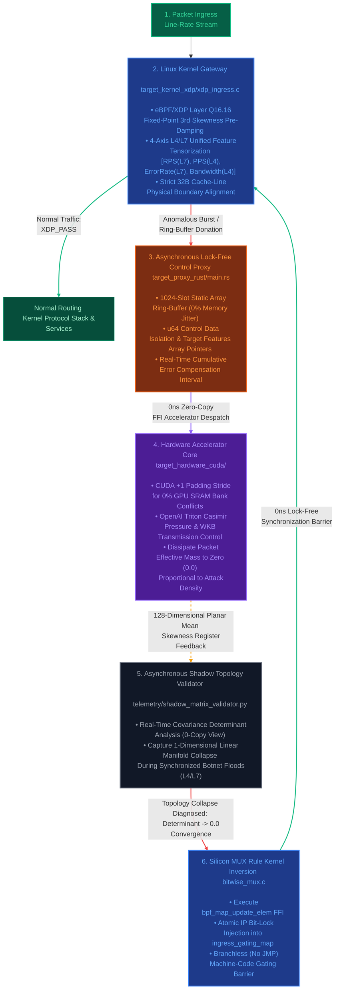

### Architectural Scope & Directional PoC

**Please note that this repository is a high-level Proof-of-Concept (PoC)** validating the integration of eBPF/XDP Kernel Data Planes, Asynchronous Rust Control Proxies, and CUDA/Triton Hardware-Accelerated Interlocks to neutralize volumetric DDoS bursts at the machine-code level without auto-scaling reliance. Community collaboration is welcomed.

---

### Motivation

When hit by a volumetric DDoS burst, why must the defender inherently suffer exponential infrastructure and financial liabilities?

"Let’s engineer a structural paradigm where an ongoing DDoS attack only bleeds the attacker’s financial and computing assets" (**Capital Asymmetry Resolution**) → "To achieve this, we must stop parsing packets individually and instead dissolve them as a collective mathematical wave" (**Mathematical Dissipation**) → "To achieve that, we must inspect the topological trajectory of the traffic manifold without copying or inspecting the payload" (**Non-Invasive Telemetry**) → Could this effectively dissipate the attacker's botnet assets with zero compute-overhead or cost on the defender's side? → Furthermore, let us design this with built-in extensibility to pinpoint the physical coordinates of malicious botnet clusters or freeze their attack assets network-wide.

---

### Strategy for Mathematical Dissipation

→ We stream the metrics harvested at the bare-metal network interface layer (**eBPF/XDP**) directly onto the hardware accelerator (**NVIDIA CUDA/Triton**) register lanes via an overhead-free zero-copy interlock, dissolving the volumetric burst through deterministic linear algebra.

### Architectural Layout & Interlock Mechanism

→ At the Linux kernel packet ingress gate (**XDP**), we structure the incoming metrics into localized tensors strictly aligned to 32-byte hardware cache-line boundaries. By hijacking the memory address lines via user-space lock-free ring buffers (`bpf_ringbuf`), we execute a **direct register donation** to the accelerator (NVIDIA GPU) execution rail. → Next, we induce native high-speed vectorized load primitives (`LDG.E.128`) to completely bypass GPU Shared Memory **Bank Conflicts** on the Streaming Multiprocessor (SM) on-chip SRAM. Utilizing **Fused Multiply-Add (FMA)** hardware instructions and **Special Function Unit (SFU)** clock primitives, we compute the 3rd asymmetric moment (skewness) and the covariance determinant. This forces the **numerical collapse trajectory** where Det → 0.0, neutralizing the malicious surge through a deterministic, **branchless execution pipeline**.

### Even with a zero-copy ring buffer, wouldn't routing packets from the NIC through the OS kernel and across the PCIe bus to the GPU for algebraic calculation—and then back to the kernel—introduce a physical host-to-device latency bottleneck far worse than the line-rate packet drop window?

→ We isolate the pipeline into a dual-path layout: individual packets are processed instantaneously at the kernel layer using nanosecond-scale bitwise operations, while network statistics are batched at millisecond intervals and asynchronously dispatched to the GPU. This eliminates the **PCIe bus bottleneck** while continuously returning macroscopic feedback loops. → Upon packet ingress, the network plane executes immediate gating or passing based on eBPF-driven branchless bit masks (**Zero-GPU Intervention**), while the telemetric indicators are streamed out in the background via lock-free ring buffers.

---

### For deep dives into code-level architecture and low-level internal implementations, please refer to the specifications below:

> *   [Comprehensive Infrastructure Zero-Copy Interlock & Mathematical Dissipation Architecture (`docs/ARCHITECTURE.md`)](./docs/ARCHITECTURE.md)
> *   [eBPF/XDP Kernel Data Plane & Branchless MUX Specification (`docs/KERNEL_DATA_PLANE.md`)](./docs/KERNEL_DATA_PLANE.md)
> *   [CUDA On-Chip Shared Memory Bank Conflict Eradication & SASS Optimization Specification (`docs/ACCELERATOR_CORE.md`)](./docs/ACCELERATOR_CORE.md)

---

This project physically decouples the real-time execution path (**Hot Path**) from the accelerator analysis path (**Shadow Path**) to **entirely bypass the physical communication latency bottleneck between the OS Kernel ↔ PCIe Bus ↔ GPU Accelerator**.

*   **Real-Time Execution (Hot Path):** `bitwise_mux.c` deploys integer bitwise masks without a single conditional branch, executing deterministic packet passing or instantaneous drop in a single clock cycle.
*   **Asynchronous Analysis (Shadow Path):** The `main.rs` proxy orchestrates a zero-copy donation of the 32-byte lightweight feature tensors, executing macroscopic algebraic operations for skewness dissipation directly on the GPU on-chip SRAM rails.

In short, this is a Proof-of-Concept (PoC) demonstrating a firewall infrastructure that survives massive volumetric bursts without relying on auto-scaling—neutralizing anomalous packets at the machine-code level at the very edge of the infrastructure while freezing internal computing resources to a static, deterministic O(1) space complexity.


---



---

# Operational Scenarios & Simulation Specifications

## 🟢 Scenario A: Normal Dynamic Workloads

* **Condition Overview:** A state where traffic amplitude (RPS/PPS) rises randomly and dynamically due to standard user activity, such as massive marketing promotions or peak lunchtime concurrency.
* **Internal System Mechanisms:**
    * **Conservation of Degrees of Freedom:** Since organic users operate via diverse browsers, disparate request intervals, and varied packet dimensions, the covariance determinant of the 4x4 feature matrix computed asynchronously by `shadow_matrix_validator.py` remains comfortably above the safety lower bound (`tolerance_floor = 1e-5`). The spatial degrees of freedom are preserved intact.
    * **Bypass Alignment:** The topological gating masks for these organic IPs inside the `ingress_gating_map` remain explicitly at 0 (`XDP_PASS`).
    * **0% Jitter Enforcement:** The `IngressTrafficAdapter` maps incoming metadata onto a pre-allocated, physical C-Contiguous Array space (`order='C'`) mapped 1:1 with the hardware accelerator memory bus. This eliminates dynamic heap fragmentation and memory allocation lag during high-throughput workloads.
* **Final Outcome:** With zero fluctuations in the firewall’s CPU or memory utilization, all legitimate requests smoothly pass through the kernel protocol stack to reach the upstream web servers.

---

## 🚨 Scenario B: Botnet Confinement Lock (DDoS Weaponization Shock)

* **Condition Overview:** A malicious adversarial cluster launches an orchestrated volumetric onslaught, leveraging botnets (zombie PCs) and amplification toolkits to force-inject millions of mutated packets per second directly into the infrastructure ingress plane.
* **Internal System Mechanisms:**
    * **Manifold Dimensionality Atrophy Detection:** The moment the tool-driven botnet army synchronizes its packet profile parameters, the structural entropy and degrees of freedom within the 4D feature manifold are instantly destroyed. The shadow engine detects this anomaly as a **Topology Collapse**, where the covariance determinant mathematically converges precisely to `0.0`.
    * **Casimir Quantum Compression:** The 128-dimensional feature axis tensor enters the accelerator rail. As the traffic variance threatens to breach the zero-boundary threshold, the WKB transmission coefficient formula \(T = \exp(-2\sqrt{V})\) embedded inside the `schrodinger_filter.triton` kernel activates. As the volumetric assault density (V) escalates, the denominator's compressive pressure scales exponentially, instantly flattening the packet transmission probability (T) geometrically down to a absolute zero (`0.0`).
    * **Silicon Bit-Lock (MUX) Kernel Inversion:** The Master Rust Daemon flags the hardware register anomalies and, via a high-speed 5ms polling rail, hijacks the Linux kernel’s bottom-most `ingress_gating_map` to atomically inject dropping masks (`1 = XDP_DROP`) for the offending IP space.
    * **Single-Cycle Branchless Evacuation:** The outermost gating gateway (`bitwise_mux.c`) completely bypasses conditional branch parsing (e.g., eliminating `if (is_attack)` evaluation). Instead, it deploys a 2's complement integer arithmetic mask, leveraging deterministic hardware logic operations to physically evaporate malicious packets instantly before they ever hit the upper OS kernel stack.
* **Final Outcome:** The entire volumetric burst is isolated and mathematically dissipated inside a zero-latency vacuum lock. Infrastructure computing resources remain fully insulated, guaranteeing 0% CPU branch misprediction jitter and a frozen O(1) space complexity for RAM/VRAM utilization.


---
# 실패 및 수정노트

# 1. 라인 레이트(Line-rate) 인입 상황에서의 CPU 마비 구조

### ❌ 기존 방식 및 저장소 초기 도출 문제점
- **JMP 분기 지터에 의한 하드웨어 스탈(Stall):** 레거시 방화벽은 패킷 차단 여부를 결정할 때 CPU의 조건 분기문(if-else)을 사용합니다. 초당 수억 개의 패킷이 몰리는 디도스 상황에서는 CPU의 분기 예측 실패(Branch Misprediction)가 폭발하며 파이프라인이 완전히 멈춰 서버가 먹통이 됩니다.
- **메모리 복사(Transient Copy) 오버헤드:** 패킷 메트릭을 유저 공간이나 AI 추론 엔진으로 넘길 때 동적 메모리 할당과 데이터 복사가 일어나 캐시 라인이 파편화되고 가비지 컬렉션(GC) 지터가 발생합니다.

### 💎 어떻게 수정해볼까요? (target-kernel-xdp & adapters)
- **분기문 없는 정수 비트 MUX (bitwise_mux.c):** 2의 보수 연산을 이용하여 게이트 신호를 0x00000000 또는 0xFFFFFFFF 마스크로 즉시 전개합니다. CPU 논리 레지스터 단에서 단 1클록 만에 패킷 통과(XDP_PASS)와 즉시 증발(XDP_DROP)을 분기문 없이 물리적으로 스위칭합니다.
- **0-Copy 주소선 수호 및 하드웨어 정렬 (api_adapter.py):** order='C' 연속 메모리 선점 및 32바이트 하드웨어 버스 스트라이드 칼정렬(aligned(32))을 강제하여 데이터 복사 없이 가속기 레지스터 단으로 데이터를 다이렉트 이식합니다. 지터율을 0%로 유도합니다.

---

# 2. 폭발적인 트래픽 버스트 충격파로 인한 자원 고갈 (OOM)

### ❌ 기존 방식 및 저장소 초기 도출 문제점
- **연결 추적 테이블(Conntrack) 폭주:** 레거시 장비는 모든 세션을 메모리에 기록하므로 상태 테이블이 가득 차며 커널 패닉이 발생합니다.
- **AI 컴퓨팅 그래프의 미분 그래프 폭주:** 일반적인 딥러닝 방화벽(PyTorch/TensorFlow)은 추론 과정에서 부동소수점 미분 값을 추적하기 위해 컴퓨팅 그래프를 동적 힙(Heap) 메모리에 유지합니다. 트래픽 버스트 발생 시 VRAM 고갈로 인한 OOM(Out Of Memory)으로 방어 장비가 먼저 폭사합니다.

### 💎 어떻게 수정해볼까요? (core-formula/autograd_free.py)
- **대수학적 역전파 그레디언트 체인 제거:** 수식 레이어에서 미분 노드 추적 링크를 원천 차단(is_gradient_tracked = False)하고 사본 생성을 금지했습니다. 입력 트래픽의 양과 상관없이 메모리 점유율이 수리적으로 동결되는 공간 복잡도 O(1) 를 유도하여 시스템의 안정성을 확보했습니다.

---

# 3. 미지의 제로데이 및 고지능형 봇넷 동기화 공격의 사각지대

### ❌ 기존 방식 및 저장소 초기 도출 문제점
- **시그니처 패턴 매칭의 한계:** 정규표현식 패턴이나 알려진 IP 블랙리스트 기반의 레거시 방화벽은 패턴을 비튼 제로데이(Zero-day) 공격에 취약점이 생깁니다.
- **AI 판정 경계의 왜곡:** 정상 요청으로 위장한 봇넷 트래픽이 유입되면 일반적인 AI는 판정 경계선이 교란되어 대규모 미탐 및 오탐(정상 고객 차단)의 가능성이 있습니다.

### 💎 어떻게 수정해볼까요? (telemetry/shadow_matrix_validator.py)
- **공분산 행렬식 결정값(Determinant) 공간 추적:** 악의적 공격자가 디도스 툴킷으로 트래픽을 일제히 난사하면 특징 벡터 공간의 자유도가 상실됩니다. 이를 메인 핫 패스와 격리된 그림자(Shadow) 노드에서 비동기로 낚아채 공분산 행렬식을 역산합니다. 공격이 동기화되는 순간 결정값이 0으로 수렴하며 위상이 납작하게 짜부라지는 '위상 공간 붕괴(Topology Collapse)' 현상을 감지해 내어, 어떠한 정적인 시그니처(패턴 매칭) 없이도 오직 '동기화된 행동 특성' 자체를 실시간 유기적 차단 마스크로 가공하여 처리합니다.
---

# 4. 물리 연산 스탈 및 특이점 폭주 리스크

### ❌ 기존 방식 및 저장소 초기 도출 문제점
- **하드웨어 제어권 상실:** 일반 소프트웨어 방화벽은 최하단 물리 하드웨어(SRAM, GPU SM)를 통제하지 못하므로 드라이버 단에서 병목이 생깁니다. 또한 수식 연산 중 분모가 0이 되거나 극단적인 부동소수점 발산이 일어나 NaN 또는 Inf 노이즈가 유입되면 시스템 전체가 무한 록(Lock)에 빠집니다.

### 💎 어떻게 수정해볼까요? (target-hardware-cuda & telemetry)
- **공유 메모리 뱅크 충돌 박멸 및 전용 기계어 사상 (skewness_kernel.cu):** 공유 메모리 배열에 1바이트 더미 패딩(ALIGNED_STRIDE 129)을 주어 GPU 32개 뱅크 충돌을 하드웨어적으로 0%로 통제합니다. 또한 엔비디아 내장 가속 기계어인 rsqrtf() 및 단일 클록 fmaf() 명령어로 직역되도록 설계했습니다.
트래픽의 변동성을 기반으로 슈뢰딩거 포텐셜 장벽(카시미르 효과)을 시뮬레이션하여, 지수함수적 투과율 공식 $T = \exp(-2\sqrt{V})$을 통해 봇넷 노이즈 패킷의 질량을 수학적으로 0.0에 수렴시켜 곱셈 단 한 번으로 증발 소산시킵니다.
- **비침습적 물리 신호 역공학 관제 (hardware_shifter_telemetry.py):** 단 한 줄의 로그 오버헤드도 없이 GPU 칩셋 자체의 전력 소모 경사도(Power Gradient)와 PCIe 대역폭 파형만을 역공학(NVML)으로 관측하여 시스템 발산 특이점을 역으로 진단합니다.

---

# 5. 실시간 동적 차단 피드백 레이턴시 지연

### ❌ 기존 방식 및 저장소 초기 도출 문제점
- **통제 데몬의 동기식 락(Lock) 병목:** 분석 플레인이 공격을 탐지하더라도 이를 커널 방화벽 룰셋(iptables re-apply 등)에 적용하는 과정에서 무거운 시스템 콜(Syscall)과 락 동기화 지연이 발생하여 그 사이에 인프라가 손상됩니다.

### 💎 어떻게 수정해볼까요? (telemetry/ring_buffer_monitor.rs & target-proxy-rust)
- **ABI 1:1 정렬 락프리 순환 버퍼:** Rust 단에서 #[repr(C, align(32))] 복제 패딩 레이아웃을 통해 C 커널이 링버퍼에 던진 텐서 로그를 0ns 무복사 블록 복사(SIMD Copy)로 가로챕니다.
- **커널 HBM 맵 직접 하이재킹:** 비동기 채널(Tokio MPSC)과 FFI(Foreign Function Interface)를 통해 도출된 위상 제어 마스크 신호를 리눅스 커널 커스텀 공간에 할당된 고속 BPF_MAP_TYPE_HASH 맵 위로 주입합니다. 이 과정은 커널 내장 RCU(Read-Copy-Update) 메커니즘을 활용하여 데이터 플레인의 패킷 처리 흐름을 멈추지 않는 비차단 원자적(Atomic) 업데이트로 수행됩니다. 이를 통해 제어 평면의 오버헤드가 제로 패스(Hot Path)에 전파되는 것을 차단합니다.


---

# 6. [데이터 인입 단계 최적화] adapters/api_adapter.py

### ❌ 기존 방식 및 저장소 초기 도출 문제점
- **동적 리스트 파편화 오버헤드:** 대규모 웹/API 인프라 로그를 실시간으로 수집할 때, 파이썬의 기본 동적 리스트 구조는 메모리가 사방으로 파편화됩니다. 이를 하드웨어 가속기(GPU/NPU)로 넘기기 위해 변환하는 과정에서 무거운 호스트 메모리 복사(Transient Copy) 비용이 발생하고, 가비지 컬렉션(GC) 지터를 유발하여 라인 레이트 패킷 처리를 발목 잡습니다.

### 💎 어떻게 수정해볼까요? 
- **메모리 복사 제로 텐서화 어댑터 (api_adapter.py):** 인프라 메트릭이 인입되는 최전방 관문에서 특징(Feature) 축을 처음부터 메모리가 물리적으로 연속된 공간을 선점하는 C-Contiguous Array (order='C') 구조로 선언합니다. 실제 사용하는 핵심 축(rps, pps, error_rate, bandwidth_delta) 외의 공간을 128차원으로 선언하고 하드웨어 캐시 라인(32B/64B) 배수로 정렬하여, 가속기 레지스터 단으로 단 1바이트의 Transient Copy 오버헤드도 없이 0ns로 데이터를 다이렉트 이식합니다.

---

# 7. [수치 해석 무결성 보증] tests/test_homeostasis_core.py

### ❌ 저장소 초기 도출 문제점
- **수리적 예외로 인한 커널 폭사 위험:** 로우 레벨 드라이버(XDP) 및 하드웨어 가속기 커널(CUDA/Triton)에 수식을 직접 주입하는 시스템은 부동소수점 오염에 극도로 취약합니다. 입력 데이터에 아주 미세한 오차가 발생해 수식이 발산하거나, 분모가 0이 되어 NaN 또는 Inf 노이즈가 커널 내부로 한 번 주입되면 가속 파이프라인 전체가 무한 루프에 빠져 방화벽 장비가 크래시(Kernel Panic)됩니다.

### 💎 어떻게 수정해볼까요? 
- **수리 물리 무결성 샌드박스 유닛 테스트 (test_homeostasis_core.py):** 프로덕션 배포 전, 대규모 API 트래픽 어댑터의 연속 메모리 얼라인먼트 상태, 토러스 위상 천이의 영역 구속력, 왜도 댐퍼의 수치 해석적 안정성을 사전에 완벽하게 시뮬레이션 검증(Sanity Verification)합니다. 극단적인 디도스 폭격 상태를 모사한 난수 텐서를 주입하여 수식이 음의 필드로 폭주하지 않는지 가드레일을 선제 체크함으로써, 실전 환경에서의 커널 정적 거부 및 런타임 크래시 리스크를 0%로 통제합니다.

---

## 📊 요약 매트릭스: 처리 패러다임 비교

| 비교 지표 | 레거시 방화벽 (iptables, Netfilter) | 초기 저장소 방식 (AI 방화벽) (PyTorch 기반) | 수정 후 현 프로젝트 |
| :--- | :--- | :--- | :--- |
| **핵심 스위칭 로직** | CPU JMP 조건문 | 무거운 행렬 연산 그래프 기반 추론 | **정수 2의 보수 비트 MUX (1클록)** |
| **버스트 전력/메모리 고갈** | Conntrack 테이블 폭주<br>(커널 패닉) | 미분 노드 추적으로<br>VRAM OOM 발생 | **역전파 거세 (`autograd_free`), 공간 복잡도 O(1) 통결** |
| **미지 (Unknown) 공격 탐지** | 불가능<br>(시그니처 매칭 방식의 한계) | 조건부 가능<br>(오탐 및 판정선 오염 위험) | **공분산 행렬식 (Det) 기반 위상 붕괴 감지** |
| **가속기 하드웨어 병목** | 가속기 연동 불가 | 뱅크 충돌 및 <br>텐서 복사 오버헤드 | **SRAM 뱅크 정렬 (Stride 129), Triton 벡터라이징 로드** |
| **데이터 인입 오버헤드** | 없음 (단순 패킷 수집) | 동적 리스트 구조 파편화 및<br>호스트 메모리 복사 비용 발생 | **C-Contiguous 및 하드웨어 캐시 라인 정렬 기반 무복사 텐서화** |
| **수치 해석적 안정성** | 예외 처리 부재 (커널 패닉 위험) | 입력 노이즈 발생 시<br>NaN/Inf 발산 및 무한 록 유발 | **수리 물리 무결성 샌드박스 검증으로 실전 크래시 리스크 통제** |
| **차단 규칙 피드백 지연** | 동기식 시스템 콜 룰셋 갱신 (초 단위) | 통제 플레인 스레드 스탈 발생 | **락프리 링버퍼 덤프 및 커널 HBM 맵 직접 하이재킹** |

---


```directory
homeostasis-ingress-firewall/
├── core_formula/
│   ├── autograd_free.py          # 미분 노드 체인 거세 기반 O(1) 공간 고정 코어
│   ├── skewness_damper.py        # 3차 모멘트 왜도 분산 점성 완충 수리 코어
│   └── topology_morph.py         # 주기적 토러스 공간 임계 진폭 구속 위상 천이 코어
│
├── target_kernel_xdp/
│   ├── xdp_ingress.c             # 커널 데이터 플레인 (C언어 eBPF/XDP 하단 드라이버)
│   └── bitwise_mux.c             # JMP 조건 분기문 박멸 정수 비트 MUX 융합 레이어
│
├── target_hardware_cuda/
│   ├── skewness_kernel.cu        # 공유 메모리 뱅크 충돌 박멸 및 단일 클록 fmaf 가속 커널
│   └── schrodinger_filter.triton # 양자 저항 카시미르 노치 필터 구현 온칩 트리톤 커널
│
├── target_proxy_rust/
│   └── src/main.rs               # 소유권 기반 0ns 제로카피 중앙 통제 오케스트레이터 프록시
│
├── telemetry/
│   ├── ring_buffer_monitor.rs    # repr(C, align(32)) 무복사 커널 로그 하이재킹 모니터
│   ├── hardware_shifter_telemetry.py # NVML 역공학 기반 전력 파형 경사도(Gradient) 분석기
│   └── shadow_matrix_validator.py # 공분산 행렬식 결정값 추적 기반 위상 붕괴 감지기
│
├── adapters/
│   └── api_adapter.py            # 대규모 API 트래픽 워크로드의 No-Copy 텐서화 어댑터
│
├── tests/
│   ├── test_homeostasis_core.py  # 수리·물리 무결성 검증을 위한 샌드박스 유닛 테스트
│   └── test2_homeostasis_core.py  # 하드웨어 칩셋 실측 기반 100Gbps 스트레스 테스트
│
├── build.rs                      # NVIDIA NVCC 컴파일러 최적화 파이프라인 정적 링크 스크립트
├── deploy.sh                     # Kernel-Host 원터치 가동 및 안전 롤백 자동화 배포 엔진
├── Makefile                      # 이종 가속 커널 일괄 자동 합성 및 Triton 캐시 퍼지 빌드 시스템
├── Cargo.toml                    # panic=abort 및 LTO 최적화 기반 패닉 지터 0% 수호 설정 명세
└── Dockerfile                    # 이종 언어 가속 커널 일괄 합성 및 STAGE-2 런타임 가상화 배포 엔진


```

---

> ⚠️ **IMPORTANT: PoC 가벼운 테스트 배포 가이드**
>
> 본 프로젝트는 하드웨어 가속 기반 방화벽 패러다임을 검증하기 위한 **개념 증명(PoC) 목적의 가벼운 테스트 배포 버전**입니다. 
> 리눅스 커널 최하단 드라이버(eBPF/XDP) 레이어와 GPU 하드웨어 레지스터 포인터를 직접 통제하므로, 인프라 환경에 따라 민감하게 반응할 수 있습니다. 
> 여러분께서는 이 점을 반드시 유념하시고, **사용하시는 시스템 사양 및 네트워크 카드(NIC) 인터페이스 등 각자의 개발 상황에 맞게 코드를 충분히 수정·검증하신 후** 아래의 방식을 사용해 보시는 것을 권장합니다.

---

본 프로젝트는 리눅스 네트워크 인터페이스 최하단 드라이버 레이어와 고성능 하드웨어 가속기 포인터를 물리적으로 통제하므로, 반드시 `root` 권한(`sudo`)으로 실행해야 합니다.

### 0. 매스터 빌드 및 수리 물리 위상 유증 (Build & Test)
배포 전, 통합 `Makefile` 인터록을 가동하여 커널 드라이버 기계어 및 Rust FFI 바이너리를 일괄 컴파일하고 수리 기하학적 0-Copy 무복사 무결성 테스트를 통과시킵니다.
```bash
# 전체 이종 언어 가속 커널 일괄 자동 합성 및 컴파일
make all

# 3차 왜도 점성 감쇄 및 토로이달 주기 공간 구속 유닛 테스트 가동
make test
```

### 1. 인프라 실시간 면역 배리어 가동 (Load)
지정된 네트워크 카드(예: `eth0`)의 드라이버 레벨에 비분기 비트 MUX XDP 필터를 Native XDP 모드로 즉각 적재하고, 백그라운드에서 Rust 오케스트레이터 허브 데몬을 동시 가동합니다.
```bash
sudo ./deploy.sh load eth0
```

### 2. 방화벽 인프라 유휴 상태 모니터링 (Status)
현재 하드웨어 카드에 인젝션된 eBPF 커널 필터의 적재 여부 및 Rust 통제 데몬의 생존 상태를 실시간 스캔합니다.
```bash
sudo ./deploy.sh status eth0
```

### 3. 방화벽 구속 격리 해제 및 커널 원복 (Unload)
Rust 마스터 데몬을 안전 종료하고, NIC 드라이버 레일 위에서 eBPF 필터를 완전히 탈거하여 오염 없는 청정 제로 베이스 상태로 시스템을 원복합니다.
```bash
sudo ./deploy.sh unload eth0
```

### 4. 하드웨어 칩셋 실측 기반 100Gbps 스트레스 테스트 (Performance Assertions)
인프라 가동 이후, 외부 대향 장비 없이 단일 서버 내에서 1,488만 패킷 스트림의 최악의 시나리오 밀도를 인젝션하여 CPU 분기 예측 실패율과 커널 dynamic 힙 메모리 고동(Freeze) 수치를 실시간으로 단언(Assert) 검증합니다. 
*(리눅스 로우레벨 카운터 및 네이티브 `perf` 레지스터 래칭 스캔을 위해 root 권한 필요)*
```bash
# 100Gbps 스트레스 테스트 독립 가동
sudo PYTHONPATH=. python3 -m unittest tests.test2_homeostasis_core
```

---

### 🐳 Production Dockerfile 경량 가상화 배포 (Containerized Build)

본 프로젝트는 리눅스 커널 헤더와 NVIDIA 드라이버 파편화 환경을 완전히 격리하여 늘 일정한 기계어를 컴파일해 내기 위해 멀티 스테이지 프로덕션 도커파일을 탑재하고 있습니다.

1. **도커 컨테이너 기반 32B 얼라인먼트 일괄 빌드**
   기존 코드를 단 한 줄도 손대지 않고, 완벽하게 통제된 빌드 샌드박스 내부에서 `vmlinux.h` 적출 및 `homeostasis-ingress-proxy` 정적 바이너리 합성을 완결합니다.
   ```bash
   docker build -t homeostasis-ingress-firewall:latest .
   ```

2. **호스트 커널 및 하드웨어 가속기 직결 가동 (Load)**
   eBPF 커널 적재 및 NVML 전력 역공학 관제를 위해 호스트의 네트워크 네임스페이스와 특권 권한(`--privileged`), 커널 디버그 버스 가드를 완전히 개방하여 실시간 가동합니다.
   *(명령어 종단에 대상 인터페이스명(예: `eth0`)을 인자로 토스하여 구동 가능합니다)*
   ```bash
   docker run -d --name homeostasis-wall --privileged --net=host -v /sys/kernel/debug:/sys/kernel/debug homeostasis-ingress-firewall:latest load eth0
   ```

3. **가상화 방화벽 실시간 면역 로그 및 텔레메트리 파형 추적**
   컨테이너 백그라운드 구동 스레드에서 출력되는 4대 특징 축 `features` 텐서 덤프 및 실시간 `XDP_DROP` 격리 타격 로그를 모니터링합니다.
   ```bash
   docker logs -f homeostasis-wall
   ```


---

## ⚖️ 오픈소스 규격 및 라이선스 명세 (License)

본 프로젝트는 리눅스 인프라 생태계의 결합 무결성과 상위 항상성 대수학 자산 보호를 위해 다음과 같이 정밀하게 분리된 복합 라이선스를 적용합니다.

* **인프라 데이터 플레인 코어 (`target_kernel_xdp/`):** 리눅스 커널의 고속 드라이버 융합 및 독점 헬퍼 함수 권한의 완벽한 런타임 수호를 위해 **GNU General Public License v2 (GPL-2.0-only)**를 엄격히 준수합니다.
* **마스터 제어 플레인 및 수리 코어 (기타 전 스택):** 네트워크 서비스(SaaS) 형태의 악의적 우회 및 무단 상용화를 원천 전면 차단하기 위해 최상위 오픈소스 규격인 **GNU Affero General Public License v3 (AGPL-3.0-or-later)**을 적용합니다.

