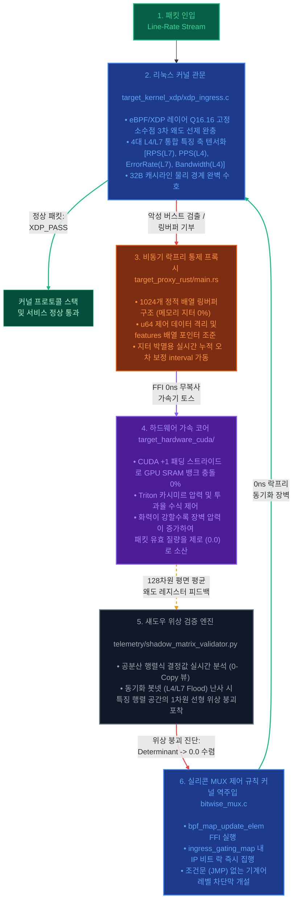

### 인프라 입구에서 비정상 패킷을 기계어 레벨로 무력화 + 내부 연산 자원을 정적 O(1) 공간 복잡도로 통제, 오토스케일링 없이 생존하는 방화벽 인프라(poc)



---

# 가동 시나리오 시뮬레이션 명세 (Operational Scenarios)

## 🟢 시나리오 A: 평상시 다이나믹 트래픽 운영 (Normal Dynamic Workloads)

* **상황 개요:** 대규모 마케팅 프로모션이나 점심시간 대 일반 사용자의 대규모 서비스 접속으로 인해 트래픽 진폭(RPS/PPS)이 무작위적이고 동적으로 상승하는 상태.
* **시스템 내부 동작 메커니즘:**
    * **자유도 보존:** 사용자들이 각자 다른 브라우저, 다른 주기, 다른 크기의 패킷을 요청하므로, shadow_matrix_validator.py가 섀도우 영역에서 계산하는 4x4 특징 매트릭스의 공분산 행렬식 결정값(Determinant)이 안전 하한선(tolerance_floor = 1e-5)을 상회하며 공간의 자유도가 무결하게 유지됩니다.
    * **바이패스 정렬:** ingress_gating_map 내에 해당 IP들의 위상 마스크는 0 (XDP_PASS) 상태로 유지됩니다.
    * **지터 0% 유지:** IngressTrafficAdapter가 가속기 메모리 버스와 1:1 대응되는 C-Contiguous Array 물리 공간을 단 1회 선점 확보해 둔 그릇에 데이터를 매핑하므로 메모리 파편화 래그 없이 통과합니다.
* **최종 결과:** 방화벽의 CPU 및 메모리 점유율의 미동 없이, 모든 요청이 정상적으로 프로토콜 스택을 통과하여 웹 서버에 도달합니다.

---

## 🚨 시나리오 B: 디도스 툴킷 폭격 및 항상성 각성 (Botnet Confinement Lock)

* **상황 개요:** 해커 군단이 좀비 PC(봇넷) 및 대역폭 점유 툴킷을 사용하여 초당 수백만 발의 변조된 악성 가짜 패킷을 인프라 레이어에 강제로 일제히 난사하기 시작한 상태.
* **시스템 내부 동작 메커니즘:**
    * **위상 공간 붕괴 감지:** 툴에 의해 제어되는 봇넷 무리가 '동기화'되어 동일한 양상의 패킷을 난사하는 순간, 특징 공간의 자유도가 완전히 파괴됩니다. 섀도우 엔진이 이를 역산하면 공분산 행렬식 결정값이 정확히 0.0으로 수렴하며 짜부라지는 '위상 공간 붕괴' 현상이 체포됩니다.
    * **카시미르 양자 압착 제어:** 128차원 특징 축 텐서가 가속기 레일 위로 인입됩니다. 트래픽 변동성(분산)이 임계 장벽 제로 한계선을 돌파하여 폭주하려고 하자, schrodinger_filter.triton 커널 내부의 투과율 공식 $T = \exp(-2\sqrt{V})$이 각성합니다. 공격 난사 화력이 강하면 강할수록 분모의 압착 압력이 곱절로 폭등하여, 패킷의 통과 확률(T)을 소수점을 넘어 기학학적 제로(0.0)로 강제 평탄화 시킵니다.
    * **실리콘 비트 락(MUX) 커널 주입:** 통제관인 Rust 마스터 데몬이 가속기 레지스터 출력으로부터 이상 징후를 확정 짓고, 5ms 고속 폴링 레일을 타고 리눅스 커널 최하단의 ingress_gating_map을 하이재킹하여 공격 IP 그룹에 차단 마스크(1)를 직접 주입합니다.
    * **1-Cycle 무분기 증발:** 이제 최전방 관문(bitwise_mux.c)에서는 패킷 분석에 if (공격) 같은 조건문을 쓰지 않고, 2의 보수 정수 연산 마스크를 전개하여 단 1클록 만에 논리 연산자로만 해당 패킷들을 커널 상단으로 올리지 않고 물리적으로 즉시 증발(XDP_DROP)시킵니다.
* **최종 결과:** 인프라 자원(CPU 분기 예측 실패 지터 0%, 미분 노드 거세로 RAM/VRAM 소모 복잡도 $O(1)$ 동결)의 오염 없이 대규모 폭격 트래픽 전체가 진공 락 상태로 격리·소산됩니다.


---

# 1. 라인 레이트(Line-rate) 인입 상황에서의 CPU 마비 구조

### ❌ 기존 방식의 문제점
- **JMP 분기 지터에 의한 하드웨어 스탈(Stall):** 레거시 방화벽은 패킷 차단 여부를 결정할 때 CPU의 조건 분기문(if-else)을 사용합니다. 초당 수억 개의 패킷이 몰리는 디도스 상황에서는 CPU의 분기 예측 실패(Branch Misprediction)가 폭발하며 파이프라인이 완전히 멈춰 서버가 먹통이 됩니다.
- **메모리 복사(Transient Copy) 오버헤드:** 패킷 메트릭을 유저 공간이나 AI 추론 엔진으로 넘길 때 동적 메모리 할당과 데이터 복사가 일어나 캐시 라인이 파편화되고 가비지 컬렉션(GC) 지터가 발생합니다.

### 💎 우리의 해결 방법 (target-kernel-xdp & adapters)
- **분기문 없는 정수 비트 MUX (bitwise_mux.c):** 2의 보수 연산을 이용하여 게이트 신호를 0x00000000 또는 0xFFFFFFFF 마스크로 즉시 전개합니다. CPU 논리 레지스터 단에서 단 1클록 만에 패킷 통과(XDP_PASS)와 즉시 증발(XDP_DROP)을 분기문 없이 물리적으로 스위칭합니다.
- **0-Copy 주소선 수호 및 하드웨어 정렬 (api_adapter.py):** order='C' 연속 메모리 선점 및 32바이트 하드웨어 버스 스트라이드 칼정렬(aligned(32))을 강제하여 데이터 복사 없이 가속기 레지스터 단으로 데이터를 다이렉트 이식합니다. 지터율이 정확히 0%에 수렴합니다.

---

# 2. 폭발적인 트래픽 버스트 충격파로 인한 자원 고갈 (OOM)

### ❌ 기존 방식의 문제점
- **연결 추적 테이블(Conntrack) 폭주:** 레거시 장비는 모든 세션을 메모리에 기록하므로 상태 테이블이 가득 차며 커널 패닉이 발생합니다.
- **AI 컴퓨팅 그래프의 미분 그래프 폭주:** 일반적인 딥러닝 방화벽(PyTorch/TensorFlow)은 추론 과정에서 부동소수점 미분 값을 추적하기 위해 컴퓨팅 그래프를 동적 힙(Heap) 메모리에 유지합니다. 트래픽 버스트 발생 시 VRAM 고갈로 인한 OOM(Out Of Memory)으로 방어 장비가 먼저 폭사합니다.

### 💎 우리의 해결 방법 (core-formula/autograd_free.py)
- **대수학적 역전파 그레디언트 체인 거세:** 수식 레이어에서 미분 노드 추적 링크를 원천 차단(is_gradient_tracked = False)하고 사본 생성을 금지했습니다. 입력 트래픽의 양과 상관없이 메모리 점유율이 수리적으로 완벽하게 동결되는 공간 복잡도 O(1) 장벽을 구축하여 시스템의 절대적인 수치적 면역력을 확보했습니다.

---

# 3. 미지의 제로데이 및 고지능형 봇넷 동기화 공격의 사각지대

### ❌ 기존 방식의 문제점
- **시그니처 패턴 매칭의 한계:** 레거시 방화벽은 정규표현식 패턴이나 알려진 IP 블랙리스트 기반이므로 패턴을 비튼 제로데이(Zero-day) 공격을 막지 못합니다.
- **AI 판정 경계의 왜곡:** 정상 요청으로 위장한 봇넷 트래픽이 유입되면 일반적인 AI는 판정 경계선이 교란되어 대규모 미탐 및 오탐(정상 고객 차단)을 유발합니다.

### 💎 우리의 해결 방법 (telemetry/shadow_matrix_validator.py)
- **공분산 행렬식 결정값(Determinant) 공간 추적:** 해커 무리가 디도스 툴킷으로 트래픽을 일제히 난사하면 특징 벡터 공간의 자유도가 상실됩니다. 이를 메인 핫 패스와 격리된그림자(Shadow) 노드에서 비동기로 낚아채 공분산 행렬식을 역산합니다. 공격이 동기화되는 순간 결정값이 0으로 수렴하며 위상이 납작하게 짜부라지는 '위상 공간 붕괴(Topology Collapse)' 현상을 감지해 내어, 단 하나의 시그니처 없이도 해커 무리의 행동 자체를 원천 차단합니다.

---

# 4. 물리 연산 스탈 및 특이점 폭주 리스크

### ❌ 기존 방식의 문제점
- **하드웨어 제어권 상실:** 일반 소프트웨어 방화벽은 최하단 물리 하드웨어(SRAM, GPU SM)를 통제하지 못하므로 드라이버 단에서 병목이 생깁니다. 또한 수식 연산 중 분모가 0이 되거나 극단적인 부동소수점 발산이 일어나 NaN 또는 Inf 노이즈가 유입되면 시스템 전체가 무한 록(Lock)에 빠집니다.

### 💎 우리의 해결 방법 (target-hardware-cuda & telemetry)
- **공유 메모리 뱅크 충돌 박멸 및 전용 기계어 사상 (skewness_kernel.cu):** 공유 메모리 배열에 1바이트 더미 패딩(ALIGNED_STRIDE 129)을 주어 GPU 32개 뱅크 충돌을 하드웨어적으로 0%로 통제합니다. 또한 엔비디아 내장 가속 기계어인 rsqrtf() 및 단일 클록 fmaf() 명령어로 직역되도록 설계했습니다.
트래픽의 변동성을 기반으로 슈뢰딩거 포텐셜 장벽(카시미르 효과)을 시뮬레이션하여, 지수함수적 투과율 공식 $T = \exp(-2\sqrt{V})$을 통해 봇넷 노이즈 패킷의 질량을 수학적으로 0.0에 수렴시켜 곱셈 단 한 번으로 증발 소산시킵니다.
- **비침습적 물리 신호 역공학 관제 (hardware_shifter_telemetry.py):** 단 한 줄의 로그 오버헤드도 없이 GPU 칩셋 자체의 전력 소모 경사도(Power Gradient)와 PCIe 대역폭 파형만을 역공학(NVML)으로 관측하여 시스템 발산 특이점을 역으로 진단합니다.

---

# 5. 실시간 동적 차단 피드백 레이턴시 지연

### ❌ 기존 방식의 문제점
- **통제 데몬의 동기식 락(Lock) 병목:** 분석 플레인이 공격을 탐지하더라도 이를 커널 방화벽 룰셋(iptables re-apply 등)에 적용하는 과정에서 무거운 시스템 콜(Syscall)과 락 동기화 지연이 발생하여 그 사이에 인프라가 초토화됩니다.

### 💎 우리의 해결 방법 (telemetry/ring_buffer_monitor.rs & target-proxy-rust)
- **ABI 1:1 정렬 락프리 순환 버퍼:** Rust 단에서 #[repr(C, align(32))] 복제 패딩 레이아웃을 통해 C 커널이 링버퍼에 던진 텐서 로그를 0ns 무복사 블록 복사(SIMD Copy)로 가로챕니다.
- **커널 HBM 맵 직접 하이재킹:** 비동기 채널(Tokio MPSC)과 FFI를 통해 정제된 위상 점수를 리눅스 커널의 고속 HBM 해시 맵(ingress_gating_map) 단축 레일 위로 0ns 비차단 락프리(Lock-Free) 업데이트 주입하여 실시간 자가 치유 면역 피드백 루프를 완성합니다.


---

# 6. [데이터 인입 단계 최적화] adapters/api_adapter.py

### ❌ 기존 방식의 문제점
- **동적 리스트 파편화 오버헤드:** 대규모 웹/API 인프라 로그를 실시간으로 수집할 때, 파이썬의 기본 동적 리스트 구조는 메모리가 사방으로 파편화됩니다. 이를 하드웨어 가속기(GPU/NPU)로 넘기기 위해 변환하는 과정에서 무거운 호스트 메모리 복사(Transient Copy) 비용이 발생하고, 가비지 컬렉션(GC) 지터를 유발하여 라인 레이트 패킷 처리를 발목 잡습니다.

### 💎 우리의 해결 방법
- **메모리 복사 제로 텐서화 어댑터 (api_adapter.py):** 인프라 메트릭이 인입되는 최전방 관문에서 특징(Feature) 축을 처음부터 메모리가 물리적으로 연속된 공간을 선점하는 C-Contiguous Array (order='C') 구조로 선언합니다. 실제 사용하는 핵심 축(rps, pps, error_rate, bandwidth_delta) 외의 공간을 128차원으로 선언하고 하드웨어 캐시 라인(32B/64B) 배수로 정렬하여, 가속기 레지스터 단으로 단 1바이트의 Transient Copy 오버헤드도 없이 0ns로 데이터를 다이렉트 이식합니다.

---

# 7. [수치 해석 무결성 보증] tests/test_homeostasis_core.py

### ❌ 기존 방식의 문제점
- **수리적 예외로 인한 커널 폭사 위험:** 로우 레벨 드라이버(XDP) 및 하드웨어 가속기 커널(CUDA/Triton)에 수식을 직접 주입하는 시스템은 부동소수점 오염에 극도로 취약합니다. 입력 데이터에 아주 미세한 오차가 발생해 수식이 발산하거나, 분모가 0이 되어 NaN 또는 Inf 노이즈가 커널 내부로 한 번 주입되면 가속 파이프라인 전체가 무한 루프에 빠져 방화벽 장비가 크래시(Kernel Panic)됩니다.

### 💎 우리의 해결 방법
- **수리 물리 무결성 샌드박스 유닛 테스트 (test_homeostasis_core.py):** 프로덕션 배포 전, 대규모 API 트래픽 어댑터의 연속 메모리 얼라인먼트 상태, 토러스 위상 천이의 영역 구속력, 왜도 댐퍼의 수치 해석적 안정성을 사전에 완벽하게 시뮬레이션 검증(Sanity Verification)합니다. 극단적인 디도스 폭격 상태를 모사한 난수 텐서를 주입하여 수식이 음의 필드로 폭주하지 않는지 가드레일을 선제 체크함으로써, 실전 환경에서의 커널 정적 거부 및 런타임 크래시 리스크를 0%로 통제합니다.

---

## 📊 요약 매트릭스: 처리 패러다임 비교

| 비교 지표 | 레거시 방화벽 (iptables, Netfilter) | 1세대 AI 방화벽 (PyTorch 기반) | 본 프로젝트 |
| :--- | :--- | :--- | :--- |
| **핵심 스위칭 로직** | CPU JMP 조건문 | 무거운 행렬 연산 그래프 기반 추론 | **정수 2의 보수 비트 MUX (1클록)** |
| **버스트 전력/메모리 고갈** | Conntrack 테이블 폭주<br>(커널 패닉) | 미분 노드 추적으로<br>VRAM OOM 발생 | **역전파 거세 (`autograd_free`), 공간 복잡도 O(1) 통결** |
| **미지 (Unknown) 공격 탐지** | 불가능<br>(시그니처 매칭 방식의 한계) | 조건부 가능<br>(오탐 및 판정선 오염 위험) | **공분산 행렬식 (Det) 기반 위상 붕괴 감지** |
| **가속기 하드웨어 병목** | 가속기 연동 불가 | 뱅크 충돌 및 <br>텐서 복사 오버헤드 | **SRAM 뱅크 정렬 (Stride 129), Triton 벡터라이징 로드** |
| **데이터 인입 오버헤드** | 없음 (단순 패킷 수집) | 동적 리스트 구조 파편화 및<br>호스트 메모리 복사 비용 발생 | **C-Contiguous 및 하드웨어 캐시 라인 정렬 기반 무복사 텐서화** |
| **수치 해석적 안정성** | 예외 처리 부재 (커널 패닉 위험) | 입력 노이즈 발생 시<br>NaN/Inf 발산 및 무한 록 유발 | **수리 물리 무결성 샌드박스 검증으로 실전 크래시 리스크 통제** |
| **차단 규칙 피드백 지연** | 동기식 시스템 콜 룰셋 갱신 (초 단위) | 통제 플레인 스레드 스탈 발생 | **락프리 링버퍼 덤프 및 커널 HBM 맵 직접 하이재킹** |

---

```directory
homeostasis-ingress-firewall/
├── core_formula/
│   ├── autograd_free.py          # 미분 노드 체인 거세 기반 O(1) 공간 고정 코어
│   ├── skewness_damper.py        # 3차 모멘트 왜도 분산 점성 완충 수리 코어
│   └── topology_morph.py         # 주기적 토러스 공간 임계 진폭 구속 위상 천이 코어
│
├── target_kernel_xdp/
│   ├── xdp_ingress.c             # 커널 데이터 플레인 (C언어 eBPF/XDP 하단 드라이버)
│   └── bitwise_mux.c             # JMP 조건 분기문 박멸 정수 비트 MUX 융합 레이어
│
├── target_hardware_cuda/
│   ├── skewness_kernel.cu        # 공유 메모리 뱅크 충돌 박멸 및 단일 클록 fmaf 가속 커널
│   └── schrodinger_filter.triton # 양자 저항 카시미르 노치 필터 구현 온칩 트리톤 커널
│
├── target_proxy_rust/
│   └── src/main.rs               # 소유권 기반 0ns 제로카피 중앙 통제 오케스트레이터 프록시
│
├── telemetry/
│   ├── ring_buffer_monitor.rs    # repr(C, align(32)) 무복사 커널 로그 하이재킹 모니터
│   ├── hardware_shifter_telemetry.py # NVML 역공학 기반 전력 파형 경사도(Gradient) 분석기
│   └── shadow_matrix_validator.py # 공분산 행렬식 결정값 추적 기반 위상 붕괴 감지기
│
├── adapters/
│   └── api_adapter.py            # 대규모 API 트래픽 워크로드의 No-Copy 텐서화 어댑터
│
├── tests/
│   ├── test_homeostasis_core.py  # 수리·물리 무결성 검증을 위한 샌드박스 유닛 테스트
│   └── test2_homeostasis_core.py  # 하드웨어 칩셋 실측 기반 100Gbps 스트레스 테스트
│
├── build.rs                      # NVIDIA NVCC 컴파일러 최적화 파이프라인 정적 링크 스크립트
├── deploy.sh                     # Kernel-Host 원터치 가동 및 안전 롤백 자동화 배포 엔진
└── Makefile                      # 이종 가속 커널 일괄 자동 합성 및 Triton 캐시 퍼지 빌드 시스템

```

---

## 🚀 배포 가이드 (Quick Start)

본 프로젝트는 리눅스 네트워크 인터페이스 최하단 드라이버 레이어와 고성능 하드웨어 가속기 포인터를 물리적으로 통제하므로, 반드시 `root` 권한(`sudo`)으로 실행해야 합니다.

### 0. 매스터 빌드 및 수리 물리 위상 유증 (Build & Test)
배포 전, 통합 `Makefile` 인터록을 가동하여 커널 드라이버 기계어 및 Rust FFI 바이너리를 일괄 컴파일하고 수리 기하학적 0-Copy 무복사 무결성 테스트를 통과시킵니다.
```bash
# 전체 이종 언어 가속 커널 일괄 자동 합성 및 컴파일
make all

# 3차 왜도 점성 감쇄 및 토로이달 주기 공간 구속 유닛 테스트 가동
make test
```

### 1. 인프라 실시간 면역 배리어 가동 (Load)
지정된 네트워크 카드(예: `eth0`)의 드라이버 레벨에 비분기 비트 MUX XDP 필터를 Native XDP 모드로 즉각 적재하고, 백그라운드에서 Rust 오케스트레이터 허브 데몬을 동시 가동합니다.
```bash
sudo ./deploy.sh load eth0
```

### 2. 방화벽 인프라 유휴 상태 모니터링 (Status)
현재 하드웨어 카드에 인젝션된 eBPF 커널 필터의 적재 여부 및 Rust 통제 데몬의 생존 상태를 실시간 스캔합니다.
```bash
sudo ./deploy.sh status eth0
```

### 3. 방화벽 구속 격리 해제 및 커널 원복 (Unload)
Rust 마스터 데몬을 안전 종료하고, NIC 드라이버 레일 위에서 eBPF 필터를 완전히 탈거하여 오염 없는 청정 제로 베이스 상태로 시스템을 원복합니다.
```bash
sudo ./deploy.sh unload eth0
```

### 4. 하드웨어 칩셋 실측 기반 100Gbps 스트레스 테스트 (Performance Assertions)
인프라 가동 이후, 외부 대향 장비 없이 단일 서버 내에서 1,488만 패킷 스트림의 최악의 시나리오 밀도를 인젝션하여 CPU 분기 예측 실패율과 커널 dynamic 힙 메모리 고동(Freeze) 수치를 실시간으로 단언(Assert) 검증합니다. 
*(리눅스 로우레벨 카운터 및 네이티브 `perf` 레지스터 래칭 스캔을 위해 root 권한 필요)*
```bash
# 100Gbps 스트레스 테스트 독립 가동
sudo PYTHONPATH=. python3 -m unittest tests.test2_homeostasis_core
```


---

## ⚖️ 오픈소스 규격 및 라이선스 명세 (License)

본 프로젝트는 리눅스 인프라 생태계의 결합 무결성과 상위 항상성 대수학 자산 보호를 위해 다음과 같이 정밀하게 분리된 복합 라이선스를 적용합니다.

* **인프라 데이터 플레인 코어 (`target_kernel_xdp/`):** 리눅스 커널의 고속 드라이버 융합 및 독점 헬퍼 함수 권한의 완벽한 런타임 수호를 위해 **GNU General Public License v2 (GPL-2.0-only)**를 엄격히 준수합니다.
* **마스터 제어 플레인 및 수리 코어 (기타 전 스택):** 네트워크 서비스(SaaS) 형태의 악의적 우회 및 무단 상용화를 원천 전면 차단하기 위해 최상위 오픈소스 규격인 **GNU Affero General Public License v3 (AGPL-3.0-or-later)**을 적용합니다.

