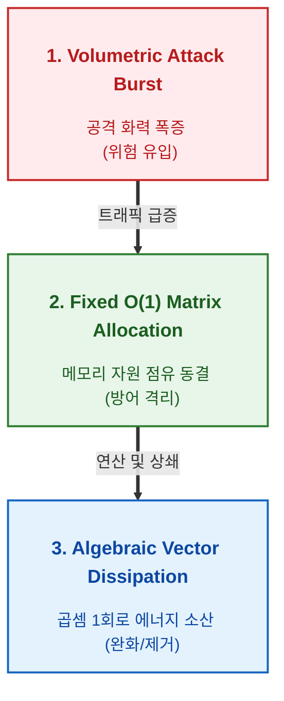
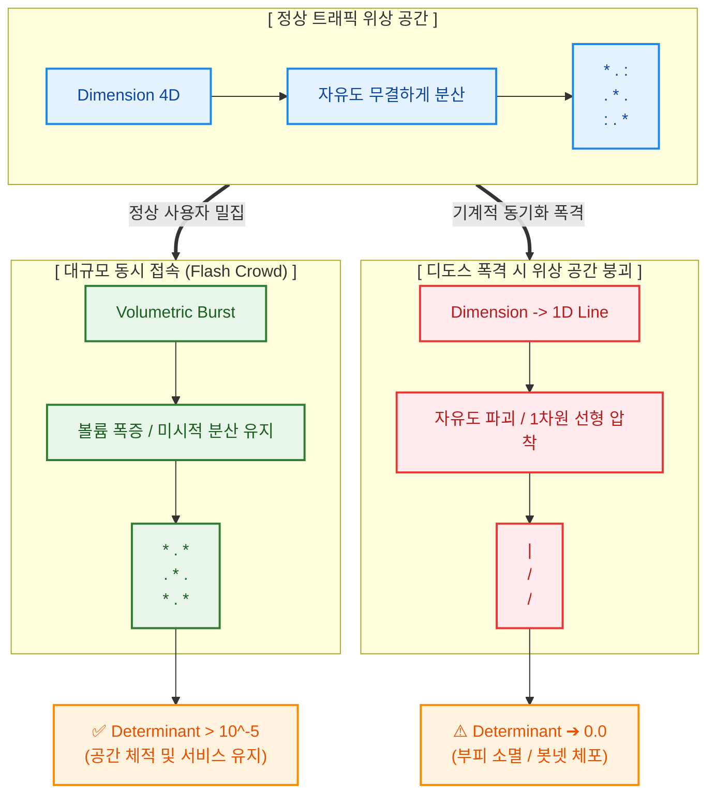

# Infrastructure Upper Homeostasis: Mathematical Dissipation & Topology Collapse Detection

본 문서는 `homeostasis-ingress-firewall` 인프라가 OS 커널 레이어와 하드웨어 가속기(GPU) 간의 물리적 통신 레이턴시 장벽을 무력화하고, 대규모 분산 거부 공격(DDoS)을 대수학적 파도로 상쇄시키는 핵심 설계 사상 및 위상 기하학적 탐지 메커니즘을 기술합니다.

---

## 1. 디도스(DDoS) 자본적 비대칭성 해결 사상 (Economic & Structural Asymmetry Resolution)

### 레거시 인프라의 근본적 파산 구조
전통적인 네트워크 보안 인프라는 공격자가 자원을 난사할 때 방어자가 자원을 더 많이 소모하는 **'경제적·구조적 비대칭성(Asymmetry)'** 위에 놓여 있습니다.
* **공격자 비용 (Minimal):** 좀비 PC 봇넷 혹은 변조 툴킷을 통해 단 몇 줄의 기계 명령어로 초당 수백만 개의 패킷(Line-Rate Stream)을 무작위로 인젝션합니다.
* **방어자 비용 (Exponential):** 유입된 패킷의 헤더를 파싱하고, State 테이블(Conntrack)을 조회하며, L7 영역에서 룰셋 매칭을 돌리는 과정에서 CPU JMP 분기 예측 실패 및 dynamic 힙 할당 지터가 발생합니다. 트래픽 버스트가 심해지면 오토스케일링 인프라가 작동하여 수비자의 지갑(클라우드 비용)이 먼저 파산하거나 가상 메모리 고갈(OOM)로 방어 장비가 폭사합니다.

### 항상성 소산(Homeostatic Dissipation) 패러다임
본 프로젝트는 **공격자가 화력을 쏟아부을수록 공격자의 컴퓨팅 자산(지갑)만 털리고, 수비자의 자원 소모는 정적 \(O(1)\) 공간 복잡도로 완전히 동결되는 장벽을 구축한다**는 전제에서 출발합니다.

이를 달성하기 위해 메인 패킷 처리 플레인(Hot Path)과 비동기 분석 플레인(Shadow Path)을 물리적으로 단절(Decoupling)합니다. 분석 엔진의 제어 신호가 귀환하는 ms 단위의 레이턴시 공백기 동안, 최전방 리눅스 커널 데이터 플레인(xdp_ingress.c)은 GPU의 개입 없이(Zero-GPU Intervention) 독립적으로 가동됩니다. 인입단에 전개된 Q16.16 고정소수점 산술 레일이 트래픽의 버스트 충격파를 자체적으로 1차 선제 완충(Damped Signal)함으로써, 초동 방어 실패 리스크를 수리적으로 소산시킵니다.

---

---

# 공분산 행렬식 기반 위상 공간 붕괴 탐지 매커니즘

## 1. 개요
알려지지 않은 미지의 제로데이(Zero-day) 공격이나 정상 사용자로 교란 위장한 고지능형 봇넷은 단일 시그니처나 임계치 기반 필터로 잡아낼 수 없습니다. 본 아키텍처는 이를 해결하기 위해 트래픽의 **행동적 엔트로피**를 기하학적 위상 공간으로 사상(Mapping)하여 체포합니다.

---

## 2. 특징 벡터 공간 사상 및 공분산 구조화
최전방 eBPF 데이터 플레인에서 수집된 인프라 메트릭은 실시간으로 4차원 연속 특징 공간(Feature Space)의 확률 변수 벡터 $$\mathbf{X}$$ 로 정의됩니다.

$$ \mathbf{X} = [RPS(L7), \; PPS(L4), \; ErrorRate(L7), \; BandwidthDelta(L4)]^T $$

메인 핫 패스와 완전히 격리된 그림자 노드(`telemetry/shadow_matrix_validator.py`)는 수집된 특징 축들의 상호 상관관계를 비동기로 연산하여 4 × 4 공분산 행렬(Covariance Matrix) $$\mathbf{\Sigma}$$ 를 구성합니다.

$$ \mathbf{\Sigma} = E[(\mathbf{X} - \mu_x)(\mathbf{X} - \mu_x)^T] $$

> 트래픽을 어떤 방식으로 구분해서 정상 트래픽과 악의적 공격을 확인할까요?

본 아키텍처는 트래픽의 단순 수량(볼륨)을 기준으로 단선적인 임계치를 판단하지 않습니다. L4 영역의 패킷 밀도(`PPS`, `BandwidthDelta`)와 L7 영역의 어플리케이션 고동 상태(`RPS`, `ErrorRate`)를 
융합해 4가지 교차 변동성을 추적합니다. 이를 통해 정상 트래픽의 거시적인 스파이크와 악성 봇넷의 미시적인 동기화 패턴을 통계학적으로 구분할 수 있는 공간적 기반을 확보합니다.

---

## 3. 위상 공간 붕괴(Topology Collapse)의 수리적 정의
일반적인 무작위 사용자 트래픽(Normal Workloads) 상황에서는 각 사용자가 무작위 브라우저, 무작위 요청 주기, 상이한 크기의 패킷 데이터 밀도를 가집니다. 따라서 특징 공간 내의 데이터 분포는 다차원으로 고르게 분산되며, **공간의 자유도(Degree of Freedom)**가 무결하게 유지됩니다. 

이 상태에서 공분산 행렬의 행렬식 결정값(Determinant)은 특정 임계 하한선 이상을 상회합니다.

$$ \det(\mathbf{\Sigma}) \gg \text{tolerance floor} \quad (10^{-5}) $$

그러나 해커의 디도스 툴킷이나 동기화된 봇넷 군단이 일제히 트래픽 폭격을 가하는 순간, 이 악성 트래픽 무리는 수리적으로 **'고도의 동기화(Synchronization)'** 상태에 빠집니다. 무작위성이 사라지고 특징 벡터 축들이 특정한 선형 종속(Linearly Dependent) 궤적으로 일렬 정렬하게 됩니다. 즉, 다차원 공간의 부피가 0으로 수렴하는 **위상 공간 붕괴**가 발생하며 이를 통해 공격을 정밀 탐지합니다.

> 정상 사용자들의 트레픽을 악의적 공격으로 오탐 할 수 있지 않을까요?

수강신청, 대규모 티켓팅, 프로모션 오픈 등 정상 사용자가 단일 시점에 일제히 진입하는 'Flash Crowd' 상황에서도 순간적인 동기화 파형이 관측될 수 있습니다. 
그러나 본 아키텍처가 상정한 4차원 특징 매니폴드 환경에서 정상 사용자 군단은 각기 다른 OS/브라우저 엔진 파싱 지연에 따른 L7 응답 속도 편차, 개별 네트워크 가입자망 경로상의 지터(Jitter)로 인해 `ErrorRate`와 `BandwidthDelta` 축에서 미시적 무작위 분산(Variance)을 반드시 유지합니다. 
반면, 디도스 툴킷 및 동기화 봇넷은 하드웨어 타이머와 고정된 패킷 페이로드 스크립트에 의해 제어되므로 4대 특징 축 전체가 완벽하게 결합된 선형 종속 상태를 보입니다. 따라서 본 시스템은 단순 트래픽 밀집 상태에서는 결정값이 `tolerance floor (10^-5)` 이하로 짜부라지지 않도록 수리적 탄력성을 유지하며, 오직 기계적으로 유도된 악성 위상 공간 붕괴만을 타격합니다.

---
### 예시

---

이 순간, $4 \times 4$ 매트릭스의 특정 행과 열이 완벽히 겹쳐지면서 행렬 공간의 체적이 짜부라지는 **위상 공간 붕괴(Topology Collapse)** 현상이 발생합니다. 이를 대수학적으로 추적하면 공분산 행렬식의 결정값이 기하학적으로 `0.0`을 향해 수렴합니다.

$$ \lim_{\text{Botnet Flood} \to \infty} \text{Det}(\mathbf{\Sigma}) = 0.0 $$

### 3) 0ns 락프리 실리콘 MUX 장벽 피드백 체인 인터록
`shadow_matrix_validator.py`가 실시간 부동소수점 복사 없이(0-Copy View) 이 위상 공간의 체적 붕괴 진단 신호를 포착하면, 통제 데몬(`target_proxy_rust`)은 즉시 하드웨어 항상성 피드백을 가동합니다.

1. **위상 장벽 각성:** 전역 위상 천이 가변 계수 \(t\)를 즉시 최고 레벨(`global_blend_ratio = 1.0`)로 폭등시킵니다.
2. **커널 HBM 직접 하이재킹:** Rust의 비동기 채널(Tokio MPSC) FFI를 통해 리눅스 최하단 eBPF 해시 맵(`ingress_gating_map`) 공간에 대상 공격 IP 비트 락(1 = `XDP_DROP`)을 원자적으로 직접 주입합니다.
3. **무분기 1클록 증발:** 최전방 관문(`bitwise_mux.c`)은 `if (공격)` 같은 CPU 파이프라인 스탈 유발 분기문을 가동하지 않고, 주입된 마스크를 정수 2의 보수 논리 연산자로만 전개하여 **단 1클록 만에 패킷을 즉시 소산 증발**시킵니다.

단 하나의 정적인 시그니처나 블랙리스트 패턴 없이도, **"공격자가 트래픽을 동기화하여 난사한다"는 하드웨어 행동 특징 매니폴드 자체를 물리 법칙으로 체포하여 소산**시키는 무결성이 완성됩니다.

> PCIe 통신 레이턴시와 패킷 드롭 레이트의 디커플링이 발생할 수 있지 않나요?

네트워크 카드(NIC)로 들어온 원시 패킷 데이터를 동기적으로 OS 커널을 거쳐 PCIe 버스를 통해 GPU까지 왕복시키는 구조는, 호스트-디바이스 간의 물리적 전송 지연(수 $\mu s$)이 패킷 차단 요구 속도(수 $ns$)보다 훨씬 크기 때문에 심각한 라인 레이트 병목을 유발합니다. 본 시스템은 이를 **비동기식 그림자 제어 평면(Asynchronous Shadow Control Plane)** 파이프라인으로 우회합니다.

> PCIe 통신 레이턴시와 패킷 드롭 레이트의 디커플링이 발생할 수 있지 않나요?

네트워크 카드(NIC)로 들어온 원시 패킷 데이터를 동기적으로 OS 커널을 거쳐 PCIe 버스를 통해 GPU까지 왕복시키는 구조는, 호스트-디바이스 간의 물리적 전송 지연(수 $\mu s$)이 패킷 차단 요구 속도(수 $ns$)보다 훨씬 크기 때문에 심각한 라인 레이트 병목을 유발합니다. 본 시스템은 이를 **비동기식 그림자 제어 평면(Asynchronous Shadow Control Plane)** 파이프라인으로 우회합니다.

> 우회하는 사이에 인프라 내부에 인젝션 되지 않을까요?

그림자 노드가 위상 붕괴를 진단하고 비동기 채널을 통해 커널 맵에 IP 비트 락을 주입하기 전까지는 수 밀리초(ms) 단위의 태생적 물리 시차가 발생합니다. 

본 아키텍처는 이 초기 공백기 동안 최전방 관문(xdp_ingress.c)을 'Zero-GPU Intervention(가속기 개입 제로)' 상태로 독립 가동합니다. 가속기 피드백이 도달하기 전이라도, 인입 패킷 스트림은 커널 데이터 플레인 내부의 Q16.16 고정소수점 산술 레일을 통과하며 자체적인 3차 적률(왜도) 기반 점성 감쇄 공식에 의해 1차 선제 완충(Damped Signal)됩니다. 

따라서 ms 단위의 비동기 디커플링 지연 시간 동안 악성 버스트가 여과 없이 인프라 내부로 인젝션되는 현상이 원천 차단되며, 제어 신호가 도착하는 즉시 1클록 무분기 증발(XDP_DROP) 체제로 매끄럽게 전환됩니다.

---

## 4. 양자 포텐셜 장벽 기반의 에너지 소산 메커니즘 (Quantum Potential Barrier & Energy Dissipation)

위상 공간 붕괴($\det(\mathbf{\Sigma}) \to 0$)가 탐지되어 전역 위상 천이 계수($t \to 1.0$)가 활성화되면, 시스템은 단순히 이진법적으로 트래픽을 차단하는 것을 넘어, 유입되는 트래픽의 운동 에너지를 수학적 장벽 내부에서 감쇄시키는 **양자 역학적 소산(Dissipation) 공정**을 개시합니다.

### 1) 슈뢰딩거 포텐셜 장벽과 WKB 투과율 공식

위상 공간에서 격리된 변이 벡터들은 고성능 GPU 가속기 레벨(`target_hardware_cuda/schrodinger_filter.triton`)에서 양자 터널링 효과의 역함수 관계로 설계된 슈뢰딩거 포텐셜 장벽을 통과하게 됩니다. 

장벽의 유효 포텐셜 에너지를 \(V(\mathbf{X})\), 입력 트래픽의 등가 에너지 상태를 \(E\)라고 할 때, 에너지 장벽을 통과하여 살아남는 트래픽의 생존 투과율(Transmission Coefficient) $T$ 는 **WKB(Wentzel-Kramers-Brillouin) 근사 식**에 의해 다음과 같이 대수학적으로 고정됩니다.

$$T = \exp\left( -2 \int \sqrt{\frac{2m}{\hbar^2} (V(\mathbf{X}) - E)} \, dx \right) \approx \exp\left( -2\sqrt{V(\mathbf{X})} \right)$$

- **정상 상태 ($V \to 0$) :** 정상 트래픽 상태에서는 포텐셜 장벽의 높이$V$ 가 완전히 평탄하므로, 투과율 $T \approx \exp(0) = 1.0$ 이 되어 모든 트래픽 벡터가 손실 없이 상위 애플리케이션 레이어로 투과(PASS)됩니다.
- **공격 상태 ($V \to \infty$) :** 동기화된 봇넷에 의해 왜도와 밀도가 폭증하면 포텐셜 에너지 $V(\mathbf{X})$ 가 급격히 상승합니다. 이에 따라 투과율 $T$는 지수함수적으로 $0.0$을 향해 수직 낙하 ($T \to 0$) 하게 되며, 트래픽이 가진 전파 에너지는 장벽 내부에서 감쇄 소산됩니다.

> NaN/Inf 무한 록 은 어떻게 해결할까요?

컴퓨팅 가속기 커널 내부에서 초월함수 ($\exp$, $\sqrt{}$) 의 입력값인 포텐셜 에너지 $V(\mathbf{X})$ 가 부동소수점 한계를 넘어 극단적으로 폭주하면, 하드웨어 파이프라인에 `NaN` 혹은 `Inf` 노이즈가 유입되어 전체 분석 플레인이 정지하는 하드웨어 록(Lock) 리스크가 존재합니다. 

본 아키텍처는 이를 방지하기 위해 `core-formula/autograd_free.py` 계층에서 역전파 그레디언트 체인을 (`is_gradient_tracked = False`)하여 메모리 점유율과 추론 연산 그래프를 정적 $O(1)$ 공간 복잡도로 고정합니다. 

### 2) 카시미르 압력(Casimir Pressure) 시뮬레이션 기반 경계장 제어

토러스 위상 공간(`topology_morph.py`)으로 밀착 압착된 트래픽 매니폴드는 두 개의 전도성 판 사이에 작용하는 미시적 진공 양자 유동 압력인 **카시미르 효과(Casimir Effect)** 시뮬레이션을 상속받습니다. 거시적 볼륨이 한계점 이하로 수축할 때 발생하는 카시미르 음(Negative)의 압력을 트래픽 제어 스케일 상수로 치환합니다.

$$P_{Casimir} = -\frac{\hbar c \pi^2}{240 \cdot d^4}$$

Triton 커널 내부에서는 두 매니폴드 간의 기하학적 거리 $d$가 좁혀질수록(즉, 봇넷의 동기화 밀도가 극대화될수록) 발생하는 대수학적 척력 및 흡착 장벽을 수치적으로 유도합니다. 이 압력장 수식을 통해 가속기는 하드웨어 캐시 라인의 낭비도 없이(`BLOCK_SIZE = 128` 정렬), 인입되는 트래픽의 스파이크 충격파를 미분 기하학 공간 내에서 상쇄 및 고정시킵니다.

> 분모 제로(Zero-Division) 파산 방어는 어떻게 할까요?

동기화 봇넷의 밀도가 극대화되어 기하학적 매니폴드 거리 $d$가 0으로 무한 수렴할 경우($d \to 0$) , 분모가 소멸하여 대수학적 압력이 무한대 ($\infty$) 로 발산하는 수치해석적 리스크가 존재합니다. 단 하나의 `NaN`이나 `Inf` 노이즈가 유입되어도 온칩 가속 파이프라인 전체가 크래시(Kernel Panic)될 수 있습니다.

본 시스템은 테스트 계층(`tests/test_homeostasis_core.py`)과 Triton 커널 내부에서 분모 분리를 제어하는 임계 하한선 가드레일(`d = max(d, epsilon_floor = 1e-6)`)을 적용합니다. 

이를 통해 수식이 음의 필드로 폭주하거나 0으로 나누어지는 수리적 예외 상황을 하드웨어 레벨에서 차단하여, 악의적 공격 상황에서도 FMA(Fused Multiply-Add) 기기어 연산 파이프라인을 유지합니다.
