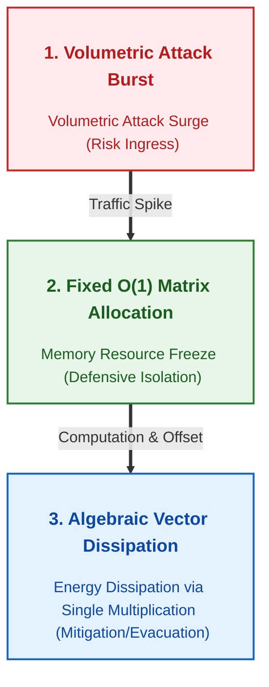
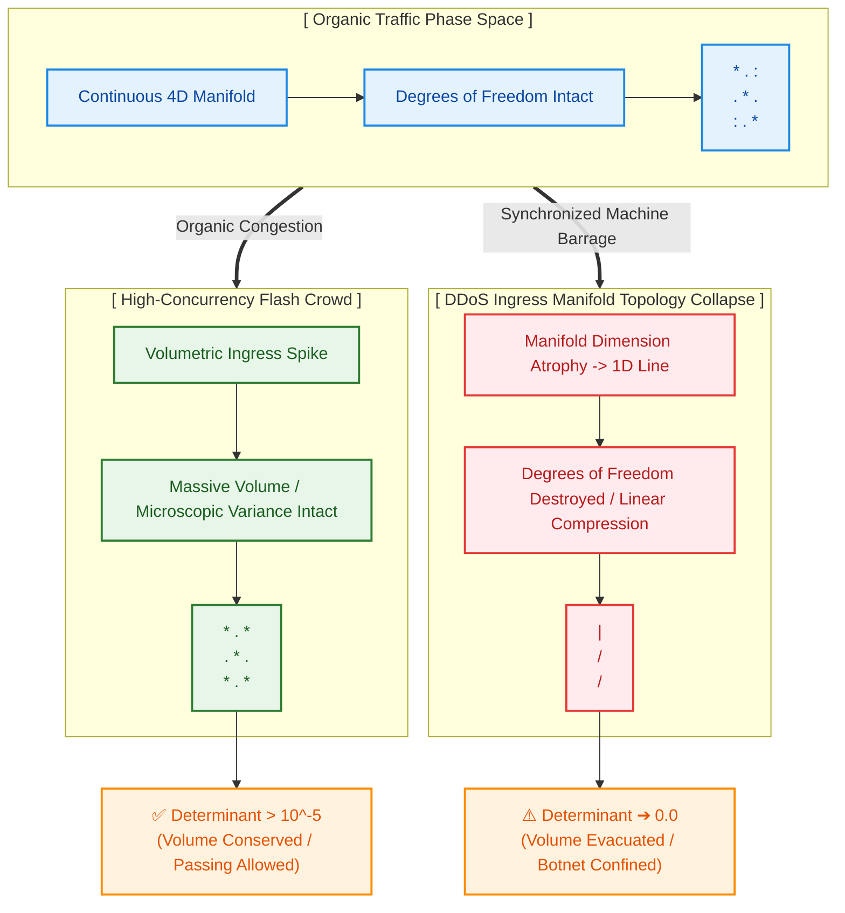

# Infrastructure Upper Homeostasis: Mathematical Dissipation & Topology Collapse Detection

This specification details the core architectural philosophy and topological manifold detection mechanisms engineered within the `homeostasis-ingress-firewall`. This framework completely insulates the infrastructure against physical communication latency barriers between the OS kernel layer and the hardware accelerator (GPU), neutralizing massive distributed denial-of-service (DDoS) bursts as a collective algebraic wave.

---

## 1. Structural & Economic Asymmetry Resolution

### The Fundamental Bankruptcy Profile of Legacy Architectures
Traditional network defense layers operate on a deeply flawed **economic and structural asymmetry**, where the defender must scale up computing power exponentially faster than the attacker to maintain service integrity.
* **Attacker Constraints (Minimal):** Deploying botnets (zombie PCs) or automated amplification toolkits requires trivial compute power to force-inject millions of corrupted packets per second (Line-Rate Stream) directly into the ingress plane.
* **Defender Liabilities (Exponential):** Extracting header bits, verifying state tracking tables (Conntrack), and running pattern matching inside L7 filters triggers continuous CPU branch mispredictions and dynamic heap allocation jitter. As the burst escalates, the infrastructure resorts to scale-out auto-scaling, bleeding the defender's cloud budget until system-wide memory starvation (OOM) triggers an absolute infrastructure failure.

### The Paradigm of Homeostatic Dissipation
This framework disrupts that dynamic entirely, engineering a barrier predicated on a singular condition: **as an adversary scales their offensive volume, the attack burns only the attacker's computing assets and budget, while the defender's computing overhead remains permanently frozen at a static \(O(1)\) space complexity.**

To secure this boundary, the real-time data execution path (Hot Path) is physically decoupled from the asynchronous analysis plane (Shadow Path). During the millisecond-scale latency gap before the shadow engine returns its updated gating rules, the outermost Linux kernel data plane (`xdp_ingress.c`) operates with absolute autonomy (**Zero-GPU Intervention**). The Q16.16 fixed-point arithmetic rails deployed directly at the ingress gate absorb and absorb traffic shockwaves into a localized **damped signal**, mathematically dissipating initial breach vectors without stalling the upper system.

---

---

# Covariance Determinant-Driven Topology Collapse Detection Mechanism

## 1. Overview
Unknown zero-day vectors or highly sophisticated botnets masquerading as organic traffic evade single-signature matching algorithms and naive threshold-based inline filters. To conquer this vulnerability, this architecture maps the **behavioral entropy** of the incoming traffic manifold into a geometric phase space, executing deterministic detection based purely on structural patterns.

---

## 2. Feature Vector Space Mapping & Covariance Structuring
Infrastructure metrics harvested at the bare-metal eBPF data plane are defined in real-time as a random variable vector $$\mathbf{X}$$ within a 4-dimensional continuous feature space.

$$ \mathbf{X} = [RPS(L7), \; PPS(L4), \; ErrorRate(L7), \; BandwidthDelta(L4)]^T $$

Completely insulated from the main hot execution path, the shadow telemetry engine (`telemetry/shadow_matrix_validator.py`) asynchronously computes the cross-correlation profiles across these feature axes to assemble the 4 × 4 Covariance Matrix $$\mathbf{\Sigma}$$ .

$$ \mathbf{\Sigma} = E[(\mathbf{X} - \mu_x)(\mathbf{X} - \mu_x)^T] $$

> How does the architecture mathematically differentiate legitimate user traffic from malicious attack surges?

This architecture rejects the simplistic paradigm of setting linear, volumetric thresholds on raw packet volume. Instead, it fuses L4 layer packet density trends (`PPS`, `BandwidthDelta`) with L7 layer application behavior states (`RPS`, `ErrorRate`) to track cross-variational trajectories across four distinct vectors. This establishes a robust statistical foundation to cleanly isolate the macroscopic spikes of organic traffic from the highly synchronized micro-patterns of automated botnets.

---

## 3. Mathematical Definition of Topology Collapse
Under normal dynamic workloads comprising randomized user traffic, individual clients operate with independent browser platforms, staggered request intervals, and highly disparate packet size densities. Consequently, the data distribution inside the 4-dimensional continuous feature space expands uniformly across multiple dimensions, leaving the **spatial degrees of freedom** fully preserved.

In this organic baseline state, the determinant of the covariance matrix remains strictly above a configured safety lower bound:

$$ \det(\mathbf{\Sigma}) \gg \text{tolerance floor} \quad (10^{-5}) $$

However, the exact cycle an adversarial weapon system or synchronized botnet array launches an orchestrated volumetric attack, the resulting traffic flows sink into a mathematically bound state of **extreme synchronization**. As organic entropy vanishes, the inbound feature vectors shift toward a linearly dependent trajectory, aligning neatly into a flattened manifold. This drives the multi-dimensional volumetric mass of the phase space to converge to zero—a phenomenon captured by the shadow loop as a **Topology Collapse**, enabling hyper-precise detection.

> Could sudden flash crowds of legitimate users confuse the boundary and trigger false positives?

During exceptional flash crowds—such as high-demand ticket sales, course registration windows, or viral marketing rollouts—legitimate organic users do create massive concurrent traffic wavelets that mimic synchronized spikes. 
Crucially, within the 4-dimensional feature manifold established by this architecture, organic traffic inevitably retains internal microscopic variance. This variance is driven by OS/browser engine processing discrepancies affecting L7 latency structures and path-level jitter over diverse ISP networks, which continuously dilutes the correlation between the `ErrorRate` and `BandwidthDelta` axes. 
Conversely, automated DDoS toolkits and zombie nodes are bound to strict hardware timer loops and static, pre-compiled packet generation scripts, forcing the entire 4-axis feature grid into an absolute, linearly dependent lock-step profile. This structural difference ensures the system retains sufficent mathematical elasticity to prevent the determinant from collapsing below the `tolerance floor (10^-5)` under human congestion, isolating and crushing only the machine-driven topology collapses.

---
### example

---

At this exact cycle, specific rows and columns of the $4 \times 4$ matrix fall into absolute alignment, triggering a **Topology Collapse** where the geometric volume of the feature manifold is flattened. Tracing this algebraically reveals that the covariance determinant geometrically converges toward `0.0`.

$$ \lim_{\text{Botnet Flood} \to \infty} \text{Det}(\mathbf{\Sigma}) = 0.0 $$

### 3) 0ns Lock-Free Silicon MUX Barrier Feedback Chain Interlock
The moment `shadow_matrix_validator.py` intercepts this structural manifold collapse via a copy-free view, the core control daemon (`target_proxy_rust`) instantaneously fires the hardware homeostatic feedback loops.

1. **Potential Barrier Escalation:** The global phase transition variable \(t\) is immediately escalated to its maximum ceiling (`global_blend_ratio = 1.0`).
2. **Direct Kernel HBM Map Hijacking:** Utilizing an asynchronous channel (`Tokio MPSC`) and FFI inside Rust, the system atomically injects dropping bitmasks (`1 = XDP_DROP`) directly onto the bottom-most Linux eBPF hash map (`ingress_gating_map`).
3. **Single-Cycle Branchless Evacuation:** The outermost ingress gateway (`bitwise_mux.c`) bypasses hardware pipeline-stalling evaluation paths (such as `if (is_attack)`). Instead, it expands the injected bitwise structure into a 2's complement integer math sequence, evaporating malicious packets instantly within a single clock cycle.

Without deploying a single static pattern, regex string, or pre-compiled blacklist, the infrastructure implements absolute system integrity—identifying and neutralizing volumetric threats by capturing the raw structural footprint of **machine-driven synchronization anomalies** directly at the bare-metal level.

> Won't the disparity between PCIe communication latency and line-rate packet drop windows cause a complete pipeline mismatch?

Synchronously routing raw packet buffers from the NIC through the OS kernel and across the physical PCIe bus to the GPU for algebraic computation—and then back to the kernel—introduces a physical transit lag (several $\mu s$) that far exceeds the line-rate packet mitigation window (a few  $ns$). This framework bypasses this physical threshold completely by segregating the workflow into an **Asynchronous Shadow Control Plane** pipeline.

> Won't the malicious traffic penetrate into the internal infrastructure during this telemetry feedback loop window?

An inherent physical propagation gap spanning several milliseconds ($ms$) inevitably occurs before the shadow node completes its topology collapse diagnosis and pushes the atomic IP bit-locks down to the kernel map via the asynchronous control channel.

To neutralize this initial vulnerability window, the outermost ingress gateway (`xdp_ingress.c`) operates with absolute autonomy under a **Zero-GPU Intervention** posture. Before the accelerator's feedback matrix arrives, the incoming packet stream runs directly through the Q16.16 fixed-point arithmetic rails embedded inside the kernel data plane, undergoing localized pre-mitigation via a 3rd statistical moment (skewness) driven viscous damping formula (**Damped Signal**).

**Consequently, this architecture completely barricades the volumetric burst from penetrating unmitigated into the internal infrastructure during the millisecond-scale asynchronous decoupling lag.** The moment the macro control signals arrive, the pipeline smoothly transitions into a deterministic, single-cycle branchless evacuation regime (`XDP_DROP`).

---

## 4. Quantum Potential Barrier & Energy Dissipation Mechanism

Once a Topology Collapse ($\det(\mathbf{\Sigma}) \to 0$) is flagged and the global phase transition coefficient ($t \to 1.0$) activates, the infrastructure shifts beyond binary block lists. Instead, it initiates a **quantum mechanical dissipation process** designed to attenuate the kinetic energy of incoming traffic vectors within a mathematical barrier field.

### 1) Schrödinger Potential Barrier & WKB Transmission Coefficient Foundations

Adversarial variance vectors isolated within the phase space are forced through a Schrödinger potential barrier engineered inside the high-performance GPU accelerator plane (`target_hardware_cuda/schrodinger_filter.triton`). This barrier models the inverse function of standard quantum tunneling constraints.

Defining the effective potential energy of the barrier as $V(\mathbf{X})$ and the equivalent energy state of inbound traffic streams as $E$, the traffic transmission coefficient ($T$) surviving the energy field is algebraically locked via the **WKB (Wentzel-Kramers-Brillouin) approximation formula**:

$$T = \exp\left( -2 \int \sqrt{\frac{2m}{\hbar^2} (V(\mathbf{X}) - E)} \, dx \right) \approx \exp\left( -2\sqrt{V(\mathbf{X})} \right)$$

- **Organic Equilibrium State ($V \to 0$) :** Under normal dynamic workloads, the potential barrier height $V$ remains perfectly flat. This drives the transmission capability to $T \approx \exp(0) = 1.0$ , allowing all organic traffic vectors to cross the boundary into upper application layers with zero attenuation (PASS).
- **Weaponized Surge State ($V \to \infty$) :** When synchronized botnets force an exponential surge in statistical skewness and volumetric density, the potential energy ceiling $V(\mathbf{X})$ spikes violently. Consequently, the transmission coefficient $T$ takes an exponential vertical dive toward absolute zero ($T \to 0$), completely crushing and dissipating the surge energy inside the barrier field.

> How does the system insulate its compute paths against wild NaN/Inf infinite hardware locks?

If the potential energy factor $V(\mathbf{X})$ processing through transcendental execution blocks ($\exp$, $\sqrt{}$) inside the hardware accelerator kernel scales past floating-point limits, it risks feeding `NaN` or `Inf` artifacts into the registers, triggering a system-wide hardware pipeline lock.

To insulate the compute rails against this vector, the `core-formula/autograd_free.py` layer completely truncates automatic differentiation backpropagation links (`is_gradient_tracked = False`). This freezes both the active inference execution graph and total memory consumption to a static, deterministic $O(1)$ space complexity regardless of inbound packet density.

### 2) Casimir Pressure Simulation-Driven Boundary Field Control

The traffic manifold tightly compressed within the toroidal phase space (`topology_morph.py`) inherits a mathematical framework modeled after the **Casimir Effect**—the microscopic vacuum quantum fluctuation pressure exerted between two parallel conducting plates. The negative Casimir pressure arising when the macroscopic volume contracts past its critical threshold is converted into a localized traffic control scaling scalar:

$$P_{Casimir} = -\frac{\hbar c \pi^2}{240 \cdot d^4}$$

Within the Triton kernel, the architecture numerically derives the algebraic repulsive and pinning barriers generated as the geometric distance $d$ between the two manifolds narrows (i.e., as the synchronization density of the botnet approaches its peak). Utilizing this pressure field equation, the accelerator continuously dampens and locks the inbound traffic spike shockwaves inside a differential geometric space without spilling a single byte of hardware cache line bandwidth (`BLOCK_SIZE = 128` alignment).

> How does the system insulate its compute paths against catastrophic zero-division math failures?

If the synchronization density of the adversarial nodes reaches absolute convergence, forcing the geometric manifold distance $d$ to approach zero ($d \to 0$), the denominator vanishes. This triggers a severe numerical risk where the algebraic pressure wildly diverges to infinity ($\infty$) . If a single `NaN` or `Inf` artifact invades the compute pipeline, it can destabilize the entire on-chip acceleration framework.

To secure this critical calculation boundary, the system enforces a strict lower-bound guardrail (`d = max(d, epsilon_floor = 1e-6)`) both within the integration validation framework (`tests/test_homeostasis_core.py`) and inside the native Triton execution loops.
>tolerance_floor (1e-5): Statistical Entropy Threshold

By implementing this constraint, mathematical singularities such as dividing by zero or running into illegal negative fields are systematically blocked at the silicon level. This guarantees that the **Fused Multiply-Add (FMA)** machine instruction pipelines remain deterministic and unbroken even under the most volatile volumetric attacks.

